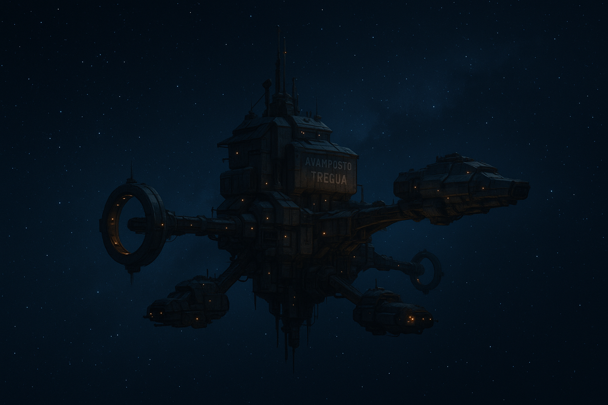

# Avamposto Tregua

*Luogo di prova — non fa parte della campagna principale.*

Piccola stazione di scambio neutrale in un tratto di spazio poco sorvegliato, punto d'appoggio per mercanti indipendenti, cacciatori di taglie e chiunque preferisca non farsi troppe domande a vicenda. Il nome è un vecchio scherzo locale: nessuno ricorda più chi lo diede per primo, ma la regola non scritta — niente vendette a bordo, i conti si saldano fuori — è rispettata quasi sempre.

## Il Retro del Motore

Il bar/cantina della stazione, gestito da [[png-doss-kellum|Doss Kellum]]. Ricavato letteralmente nel vano di un vecchio motore a fusione dismesso, con tavoli sistemati tra le paratie originali ancora visibili. È il fulcro sociale della stazione: se succede qualcosa, prima o poi se ne parla qui.

- **Sala principale**: bancone, una dozzina di tavoli, luce bassa. È qui che [[png-nix-calder|Nix Calder]] passa le sue serate.
- **Retrobottega**: ufficio di Doss, con una piccola cassaforte a combinazione meccanica (non elettronica — Doss diffida della tecnologia per le cose davvero importanti). Scena del furto.

## Corridoi di Manutenzione

Un dedalo di passaggi stretti dietro le pareti abitabili della stazione, usati dal personale tecnico e, a quanto pare, da chiunque voglia sparire in fretta. Poco illuminati, pieni di condotti e schede di accesso ai sistemi. Portano verso il settore degli attracchi minori, meno sorvegliato.

## Note per il GM

Ambientazione volutamente generica e priva di dettagli superflui: serve solo da sfondo per [[quest-conti-in-sospeso|Conti in Sospeso]]. Nessun bisogno di svilupparla oltre — verrà rimossa insieme al resto di `quest-prova/` al termine del test.
