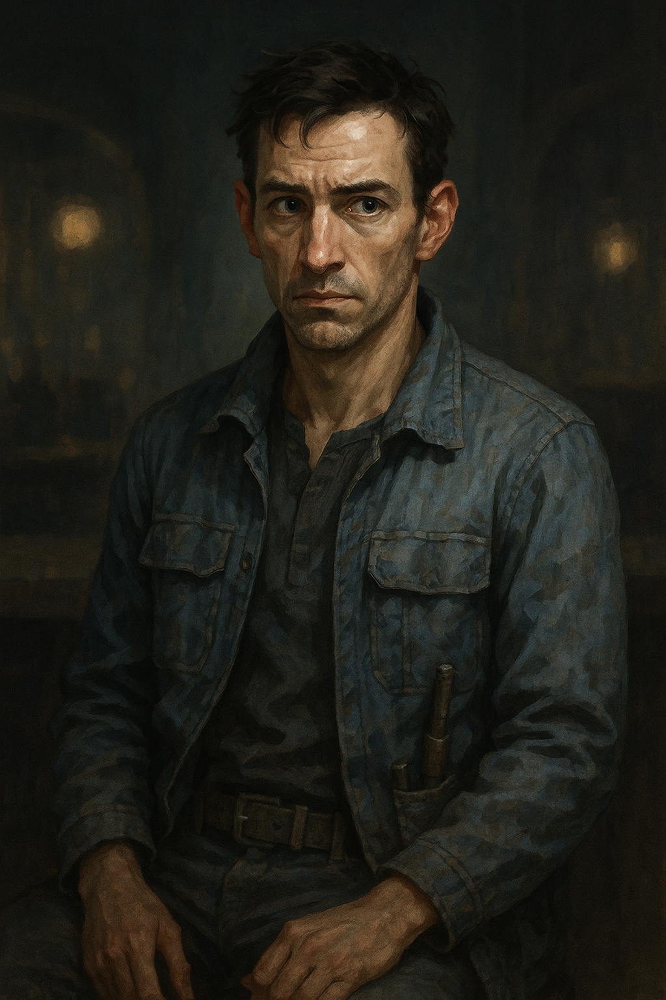

# Nix Calder

*PNG di prova — non fa parte della campagna principale.*

Meccanico freelance, passa più serate a [[luogo-avamposto-tregua#Il Retro del Motore|Il Retro del Motore]] che nel proprio alloggio. Era presente la notte del furto, seduto vicino al retrobottega, e non gli è sfuggito granché — ma non ha nessuna intenzione di farsi coinvolgere in guai che non lo riguardano.

## Cosa sa

- Ha visto qualcuno allontanarsi in fretta dal corridoio dietro il bancone poco prima della chiusura, diretto verso i [[luogo-avamposto-tregua#Corridoi di Manutenzione|Corridoi di Manutenzione]] — corporatura minuta, giacca scura con una toppa gialla sulla manica.
- Riconosce la descrizione se interrogato con insistenza: è quasi certamente [[nemico-ressa-doon|Ressa Doon]], nota alla stazione per piccoli furti mirati, mai violenti.
- Ha sentito voci (non prove dirette) che Doss Kellum "si fa restituire i prestiti con gli interessi, quelli veri" — e che più di un mercante della stazione gli deve dei favori che preferirebbe non dovergli.

## Come convincerlo a parlare

Non è ostile, solo prudente. Diplomazia o Raggirare CD 16 per convincerlo che non finirà nei guai; Intimidire funziona ma CD 18 e lo rende meno disposto a condividere il pettegolezzo su Doss (si limita ai fatti diretti). Se gli si offre da bere o un piccolo favore prima di chiedere, -2 alla CD.

## Note per il GM

Va usato come fonte di due informazioni distinte, da dare anche separatamente se il giocatore fa più tentativi: (1) la pista fisica verso [[nemico-ressa-doon|Ressa Doon]] e i corridoi di manutenzione, necessaria per far avanzare la trama; (2) il sospetto su Doss, opzionale ma utile per la scelta finale in [[quest-conti-in-sospeso|Conti in Sospeso]].
