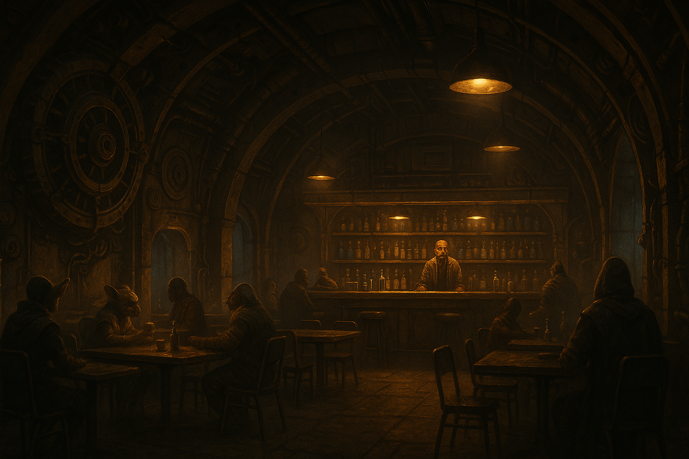

# Il Retro del Motore

Il bar/cantina di [[avamposto-tregua|Avamposto Tregua]], gestito da [[../png/doss-kellum|Doss Kellum]] da quindici anni. Ricavato letteralmente nel vano di un vecchio motore a fusione dismesso — da cui il nome — con tavoli sistemati tra le paratie curve originali e i condotti del vecchio impianto ancora visibili a vista in pareti e soffitto. È il fulcro sociale della stazione: se succede qualcosa ad Avamposto Tregua, prima o poi se ne parla qui, tra un giro di bevande e l'altro.

Luce bassa e calda, un misto di specie diverse ai tavoli, nessuno che faccia troppe domande di troppo — coerente con lo spirito da "porto franco" di tutta la stazione.

## Sala principale

Bancone, una dozzina di tavoli spaiati, luce bassa. [[../png/nix-calder|Nix Calder]] ci passa più serate che nel proprio alloggio, di solito seduto vicino al retrobottega — è per questo che ha visto la fuga di [[../nemici/ressa-doon|Ressa Doon]] la notte del furto.

## Retrobottega

Ufficio privato di Doss, con una piccola cassaforte a combinazione meccanica — non elettronica, perché Doss diffida della tecnologia per le cose davvero importanti. È qui che Ressa Doon ha rubato la [[../oggetti/chiave-di-memoria|Chiave di Memoria]], senza forzature evidenti sul meccanismo (lavoro da professionista, non da dilettante). Accesso riservato, di norma, a Doss e a chi ha la sua fiducia.

## Note per il GM

Scena centrale di [[../quest/conti-in-sospeso|Conti in Sospeso]] — Scena 1 (l'incarico, al bancone) e Scena 2 (la scena del crimine, nel retrobottega) si svolgono entrambe qui. Vedi [[../guide-gm/conti-in-sospeso|Guida GM — Conti in Sospeso]] per le CD e i dettagli investigativi. Come il resto di Avamposto Tregua, deliberatamente non sviluppata oltre l'essenziale — nessun PNG fisso oltre a Doss e Nix, nessuna mappa dettagliata — finché non serve davvero al tavolo.
