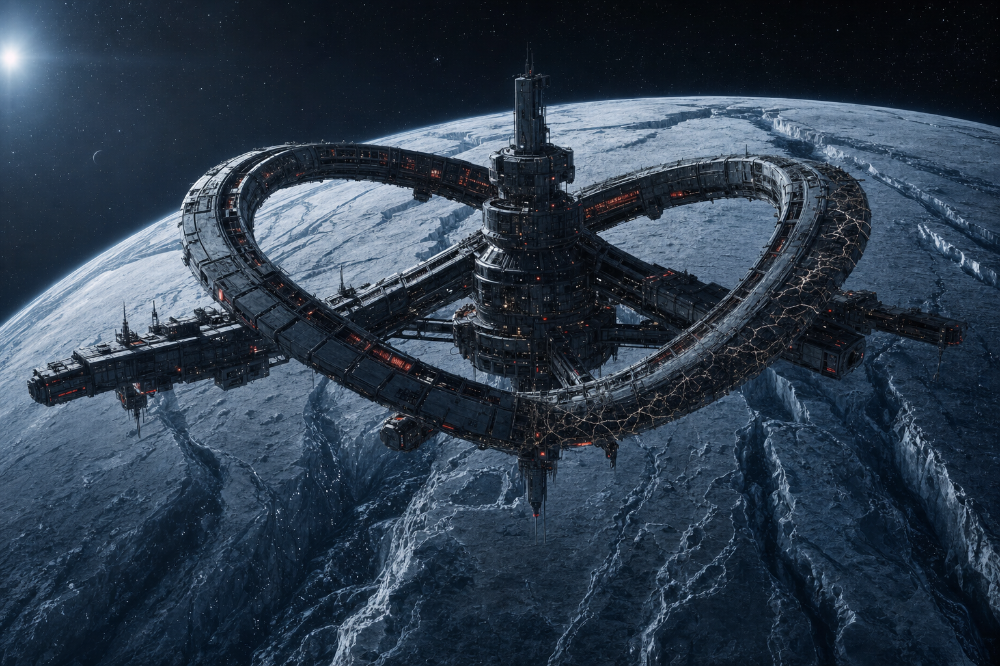

# Stazione Elice-7

Avamposto di ricerca xenoarcheologica di [[../fazioni/solmark-ricerche|Solmark Ricerche]], in orbita bassa attorno a [[sistema-di-ordessa#Tessitrice (luna di Kaldenor)|Tessitrice]]. Costruita a forma di doppia elica attorno a un nucleo centrale (da cui il nome), ospitava un equipaggio di 34 persone tra scienziati, tecnici e sicurezza. Silenzio radio da 10 giorni. Location principale della quest [[il-filo-spezzato|Il Filo Spezzato]].

## Il ritrovamento

Sei mesi fa, un team guidato dalla xenoarcheologa [[renn-kade|Dr.ssa Renn Kade]] ha scoperto sotto il ghiaccio di Tessitrice una struttura pre-Intervallo di origine sconosciuta: un manufatto a forma di telaio, soprannominato informalmente **il Telaio**, sepolto in una camera naturale a 40 metri di profondità. Da allora la stazione si è concentrata quasi esclusivamente sul suo studio.

## Struttura (per il GM)

Tre bracci principali collegati al nucleo centrale, più il tunnel di accesso alla camera del Telaio scavato sotto la superficie.

| Area | Cosa contiene | Ruolo nella quest |
|---|---|---|
| **Attracco e Nucleo Centrale** | Hangar, sala comune, uffici amministrativi | Punto d'ingresso; qui si trova [[toby-ferra\|Toby Ferra]], primo contatto |
| **Braccio A — Laboratori** | Laboratori di analisi, archivio dati, alloggi scienziati | Indizi (registri, campioni), possibile incontro con [[renn-kade\|Renn Kade]] nascosta |
| **Braccio B — Sistemi e Ingegneria** | Sala server, generatori, supporto vitale | Evento minore "Il Guasto" (vedi [[il-filo-spezzato\|Il Filo Spezzato]]); qui avviene la **Battaglia 1** contro i [[tessuto-corrotto\|Tessuti Corrotti]] |
| **Braccio C — Sicurezza e Alloggi** | Armeria, alloggi equipaggio, cella di quarantena (vuota, forzata dall'interno) | Tracce della squadra di [[ilsa-draak\|Ilsa Draak]]; possibile **Battaglia 2** contro i mercenari Kestrel, a seconda di come i PG la gestiscono |
| **Tunnel di Accesso e Camera del Telaio** | Scavo, camera sotterranea con il Telaio attivo | Rivelazione finale e **Battaglia Boss** contro [[ordito\|l'Ordito]] |

## Cosa si può trovare esplorando

I giocatori cercheranno in giro — ecco cosa c'è, area per area. Niente di eccessivo: la stazione non è un dungeon da saccheggiare, ma è coerente che un avamposto di ricerca improvvisamente abbandonato abbia ancora provviste, attrezzatura e oggetti personali in giro.

| Area | Cosa si trova |
|---|---|
| **Attracco e Nucleo Centrale** | Uffici amministrativi: registri di spedizione, niente di prezioso. La sala comune ha un piccolo distributore di razioni ancora funzionante. [[toby-ferra\|Toby Ferra]] è disposto a condividere strumenti diagnostici di base se richiesti (non un dono, un prestito). |
| **Braccio A — Laboratori** | Attrezzatura scientifica specialistica (kit di analisi, campioni catalogati) — poco vendibile fuori da un contesto accademico, ma utile per prove di [[Scienza Fisica]]/[[Scienza Biologica]]/[[Misticismo]]. Un cassetto chiuso a chiave nell'ufficio di [[renn-kade\|Renn Kade]] (Ingegneria o Rapidità di Mano CD 18) contiene un secondo **[[../oggetti/campione-di-filo-corrotto\|Campione di Filo Corrotto]]**, raccolto prima che le cose precipitassero. |
| **Braccio B — Sistemi e Ingegneria** | Pezzi di ricambio e componenti tech (ingombro 1, valore 2d6 × 10 crediti se rivenduti). Nella sala server, un terminale isolato conserva un backup parziale dei log della stazione — stessa funzione narrativa dell'evento "Registro Criptato" in Braccio A, utile come fonte alternativa se il party ha saltato quella scena. |
| **Braccio C — Sicurezza e Alloggi** | **Armeria**: 2-3 armi standard Solmark di livello 6-7 (a scelta del GM da [[../regole/equipaggiamento\|Equipaggiamento]]), pensate per il personale di sicurezza — un buon upgrade per chi nel party ha ancora equipaggiamento datato. **Alloggi**: effetti personali dell'equipaggio disperso — niente di prezioso, ma un diario vocale personale di un tecnico scomparso è un'ottima scena di colore se qualcuno lo ascolta (a discrezione del GM, componilo al tavolo). |
| **Tunnel di Accesso e Camera del Telaio** | Dopo la Battaglia Boss: il **[[../oggetti/frammento-del-telaio\|Frammento del Telaio]]**, impossibile non notarlo. |

## Atmosfera

Gravità artificiale instabile in alcune sezioni (i generatori sono danneggiati, non distrutti), illuminazione di emergenza rossastra nei bracci B e C, lunghi tratti di corridoio con superfici che sembrano "cucite" da filamenti metallici cresciuti dal nulla — l'effetto visibile della presenza dell'[[ordito|Ordito]]. Nessun cadavere nei bracci pubblici: chi non si è nascosto o non è fuggito è stato "tessuto".

## Note per il GM

Non serve una mappa a griglia precisa: la stazione è pensata come sequenza di scene investigative concatenate, non come dungeon-crawl stanza per stanza. Usa la tabella sopra per decidere cosa i PG trovano in base a dove decidono di andare prima.
