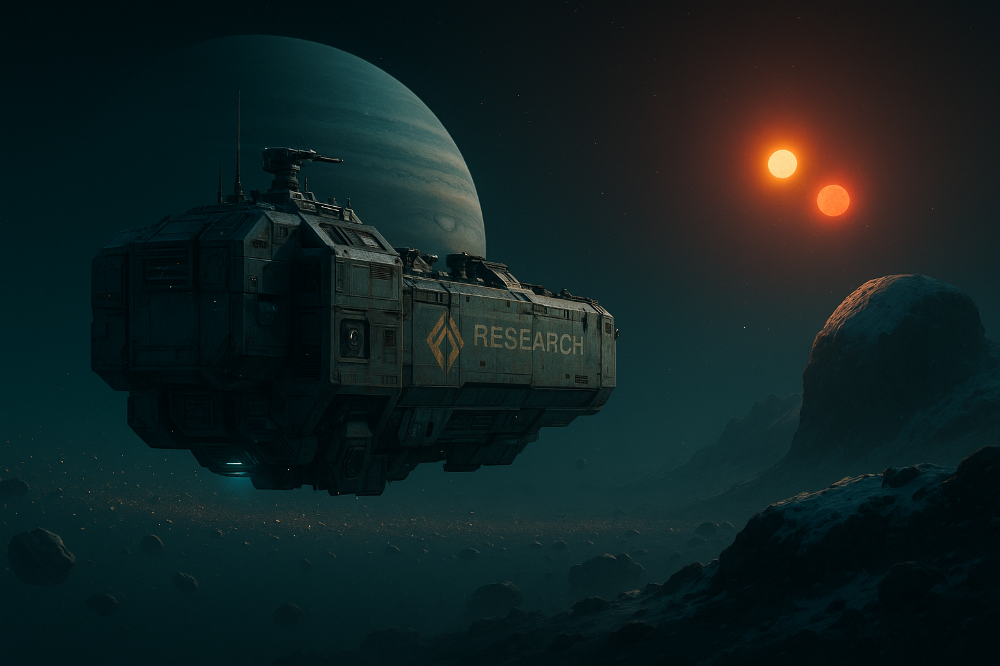

# Filo di Arianna

Nave assegnata al party da [[imara-voss|Imara Voss]] per raggiungere il [[sistema-di-ordessa|Sistema di Ordessa]] e la [[stazione-elice-7|Stazione Elice-7]] — un prestito di Solmark Ricerche, non una proprietà del party (almeno per ora). Il nome, scelto da un membro dello staff con un debole per i miti antichi, si rivelerà involontariamente calzante.

## Concept

Esploratore leggero riconvertito da un vecchio scafo da trasporto: non elegante, ma affidabile, con sensori potenziati per il rilevamento di anomalie (pensato per il lavoro di scouting scientifico di Solmark) e abbastanza spazio di stiva per un party di 5-6 persone più equipaggiamento.

## Statistiche (Tier 4 — adeguata a un party di livello 8)

| Taglia | Velocità | Manovrabilità | CA | CS |
|---|---|---|---|---|
| Grande | 8 | Buona (+2 Pilotare) | 17 | 15 |

| Scafo (PF) | Soglia Critica | Scudi (PF) | TS |
|---|---|---|---|
| 65 | 13 | 40 (40 SF per quadrante) | +2 |

**Sistemi**: sensori a lungo raggio potenziati (bonus di circostanza +4 a Percezione e Computer per rilevare anomalie/segnali), computer di bordo di categoria buona, alloggi per 8, stiva merci media, laboratorio scientifico minore (permette prove di [[Scienza Fisica]] e [[Scienza Biologica]] a bordo).

**Armamento**: una torretta a energia leggera (danno 2d8, PA 4) — sufficiente a scoraggiare pirati minori, non pensata per il combattimento navale serio.

## Ruolo nella quest

Trasporta il party attraverso la [[sistema-di-ordessa#Cintura di Vetro|Cintura di Vetro]] fino a Tessitrice — qui i sensori potenziati diventano rilevanti per l'evento minore "Tempesta di Schegge" (vedi [[il-filo-spezzato|Il Filo Spezzato]]). Resta attraccata all'hangar della [[stazione-elice-7|Stazione Elice-7]] durante l'esplorazione, sorvegliata da [[toby-ferra|Toby Ferra]] se il party lo desidera.

## Note per il GM

Statistiche pensate per essere giocabili subito, non per un combattimento navale complesso: la quest non prevede scontri tra astronavi. Se la campagna in futuro vorrà rendere la Filo di Arianna una nave propria del party (invece che un prestito), è un gancio narrativo naturale da introdurre a fine quest tramite [[imara-voss|Imara Voss]] come parte della ricompensa.
