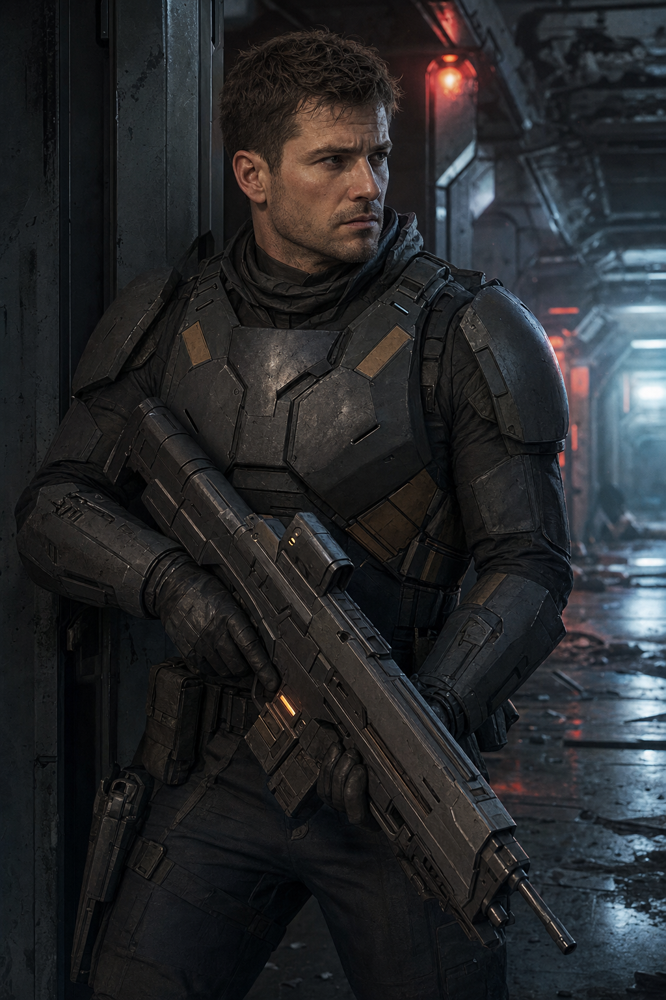

# Mercenario Kestrel

Soldato professionista della compagnia mercenaria **[[../fazioni/kestrel-recovery|Kestrel Recovery]]**, agli ordini di [[ilsa-draak|Ilsa Draak]]. Combattenti competenti ed equipaggiati, ma non fanatici: combattono per obiettivi tattici, non fino alla morte certa (vedi Tattiche). Nemici della **Battaglia 2**, nel Braccio C — Sicurezza e Alloggi.

*Composizione consigliata dell'incontro: 3 Mercenari Kestrel + [[ilsa-draak|Ilsa Draak]] (statistiche nella sua pagina) contro un party di 5-6 PG di livello 8. Vedi anche la nota su risoluzione non violenta nella pagina di Ilsa Draak.*

## Statistiche (mercenario base)

| GS | Allineamento | Taglia/Tipo | Iniziativa | Sensi |
|---|---|---|---|---|
| 5 | N | Media, Umanoide (umano) | +5 | Percezione +12 |

| CAE | CAC | PF | Tempra | Riflessi | Volontà |
|---|---|---|---|---|---|
| 18 | 19 | 58 | +7 | +8 | +5 |

**Velocità** 9 m · **Armatura**: leggera tattica

## Attacchi

- **Distanza** — Fucile tattico a energia +12 (2d6+6 fuoco, automatico)
- **Mischia** — Lama da combattimento +11 (1d6+6 taglio)

## Capacità Speciali

- **Copertura Tattica**: bonus +2 alla CAE/CAC quando dietro copertura parziale o superiore (standard, enfatizzato perché la squadra la usa attivamente).
- **Fuoco di Soppressione**: una volta per combattimento, un mercenario può costringere un bersaglio in linea di tiro a scegliere tra restare coperto (niente azioni offensive quel turno) o subire un attacco con bonus +2.

## Tattiche

Combattono in modo organizzato, usano coperture, si ritirano verso [[ilsa-draak|Ilsa Draak]] se scendono sotto un terzo dei PF, e si arrendono o si ritirano come gruppo se Ilsa stessa viene messa fuori combattimento o decide di negoziare. Non è un combattimento all'ultimo sangue a meno che i PG non lo rendano tale.

## Bottino

Professionisti equipaggiati, vale la pena perquisirli:

- **Ognuno**: il proprio Fucile tattico a energia e Lama da combattimento (rivendibili, valore standard da regolamento per armi di livello equivalente), più 2d10 × 10 crediti in contanti/carte prepagate non tracciabili.
- **Uno dei tre** (a scelta del GM): un **[[../oggetti/datapad-criptato-kestrel|Datapad Criptato Kestrel]]** con parte degli ordini di missione — l'indizio principale su chi ha ingaggiato la squadra.
- **Armatura leggera tattica**: recuperabile ma difficile da rivendere rapidamente (marchiata Kestrel Recovery) senza sollevare domande in un porto franco onesto.

Se il party sceglie di derubare [[ilsa-draak|Ilsa Draak]] stessa (es. se viene messa K.O. e perquisita mentre priva di sensi), vedi la sezione "Bottino" nella sua pagina — e le conseguenze del farlo.
