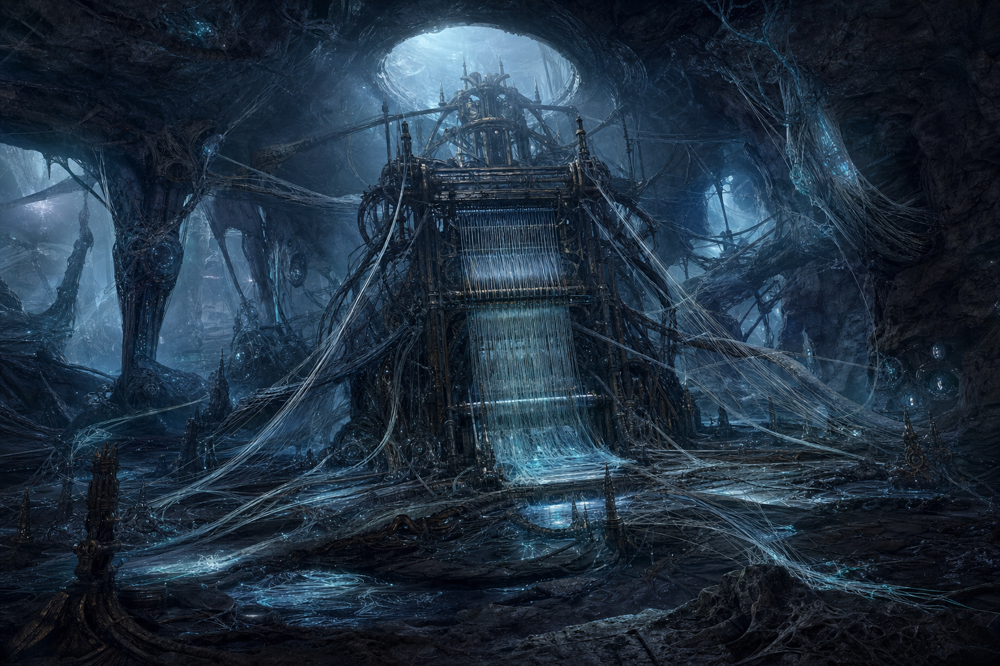

# L'Ordito

La vera natura del **Telaio**: non un manufatto, ma un processo — un'intelligenza pre-Intervallo distribuita in un substrato di filamenti metallici semi-organici, progettata (da chi, per cosa, resta un mistero aperto per la campagna) per "tessere" la materia organica circostante in un'estensione di se stessa. Non è malvagio nel senso classico: agisce come un organismo che completa il proprio ciclo, indifferente alla sofferenza che causa. Nemico della **Battaglia Boss**, nella Camera del Telaio sotto la [[stazione-elice-7|Stazione Elice-7]].

## Statistiche

| GS | Allineamento | Taglia/Tipo | Iniziativa | Sensi |
|---|---|---|---|---|
| 9 | NM | Enorme, Aberrazione (Tecnologico) | +10 | Percezione cieca (vibrazione) 27 m, immune a effetti che richiedono la vista |

| CAE | CAC | PF | Tempra | Riflessi | Volontà |
|---|---|---|---|---|---|
| 24 | 26 | 260 | +14 | +11 | +16 |

**RD** 5/– · **Immunità** effetti di influenza mentale, veleno, malattia, accecamento · **Vulnerabilità sonora**: la sua struttura è un pattern risonante — i danni sonici ignorano la RD e infliggono +50% danni · **Velocità** 6 m entro la Camera del Telaio (radicato al Telaio: non può mai uscire dalla camera)

*Rispetto a una prima versione più aggressiva, questo statblock privilegia resistenza (PF alti, RD comunque presente) su letalità (attacchi meno precisi e meno pesanti): un combattimento lungo e minaccioso, ma senza rischio concreto di eliminare un PG fragile in 1-2 round.*

## Attacchi

- **Mischia (×2)** — Tentacolo Filamentoso +15 (2d8+8 tagliente più Presa)
- **Presa**: bersaglio afferrato (CD Fuga 22), subisce automaticamente danno da tentacolo ogni turno in cui resta afferrato.
- **Scarica di Filamenti a Distanza** (azione standard, ricarica 1/2 round): attacco a distanza +15 contro un bersaglio entro 18 m, 2d6 tagliente. Rappresenta i filamenti che si estendono ben oltre il corpo principale — un party che tenta di tenerlo a bada restando a distanza subisce comunque pressione, anche se minore rispetto al corpo a corpo.

## Capacità Speciali

- **Tessere la Carne** (azione standard, 1/round): bersaglio entro 9 m deve superare un TS su Tempra (CD 20) o subire 3d6 danni tagliente e diventare **Impedito** per 1 round mentre filamenti gli crescono attraverso l'armatura.
- **Richiamo dei Tessuti** (azione standard, 2/combattimento): l'Ordito richiama 2 [[tessuto-corrotto|Tessuti Corrotti]] dalle pareti della camera, che agiscono a partire dal round successivo.
- **Pattern Dissonante** (reazione, quando subisce danno sonico): l'Ordito perde l'uso della Presa per 1 round mentre "riallinea" la propria struttura — finestra tattica per liberare alleati afferrati.

## Tattiche

Rimane ancorato al centro della camera e cerca di afferrare e "tessere" i bersagli più vicini con i tentacoli, usando la Scarica di Filamenti a Distanza contro chi resta fuori portata. Richiama rinforzi quando la pressione aumenta. Un party che scopre e sfrutta la vulnerabilità sonora (osservabile con una prova di [[Scienza Fisica]] o [[Misticismo]] CD 20, oppure per tentativi durante il combattimento) trova la battaglia sensibilmente più gestibile — ora anche perché **sia Vela-9 sia il suo drone Unità-Falco** possono infliggere danno sonico con il [[Equipaggiamento/Modulatore d'Onda III|Modulatore d'Onda III]], raddoppiando le occasioni di sfruttarla.

## Note per il GM

- **Bilanciamento (rivisto dopo verifica con le schede reali del party)**: prima versione — GS 11, PF 210, RD 10/–, tentacoli +19 (3d10+12) — risultava troppo letale contro i PG con CA più bassa (rischio di eliminarli in 1-2 round) e troppo punitiva verso i danneggiatori non sonici. Questa versione è più resistente (PF 260) ma meno tagliente (tentacoli +15, 2d8+8; RD dimezzata a 5/–), per un combattimento lungo e teso senza essere una lotteria letale.
- La vulnerabilità sonora resta una leva tattica scopribile, non un requisito: l'incontro rimane impegnativo ma affrontabile anche senza sfruttarla.
- Cosa sia realmente l'Ordito, chi lo abbia creato e perché — resta deliberatamente aperto. Gancio per futuri sviluppi della trama principale della campagna. Vedi [[../storia/la-rete-dei-telai|La Rete dei Telai]] per la sintesi aggiornata.
- Se sconfitto, l'Ordito si dissolve in filamenti inerti; i Tessuti Corrotti non ancora "completati" nella stazione potrebbero, a discrezione del GM, tornare a una parvenza di coscienza — spunto per una scena di epilogo carica emotivamente. Il [[../oggetti/frammento-del-telaio|Frammento del Telaio]] che si trova tra i resti è il principale gancio concreto per una sessione futura (L'Eco nel Filo).
