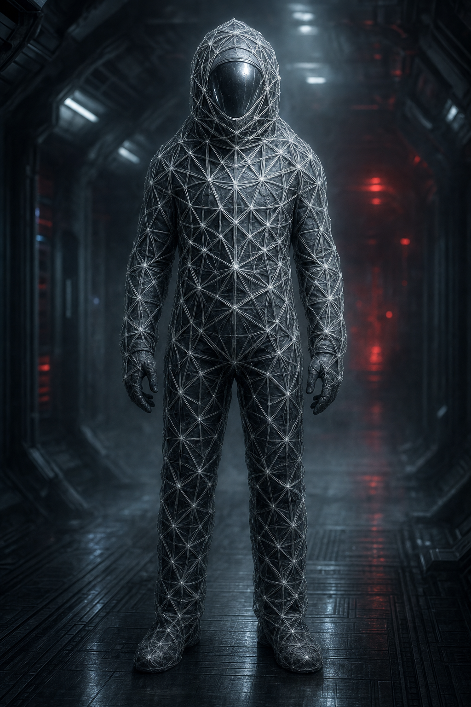

# Tessuto Corrotto

Ciò che resta di un membro dell'equipaggio (o di un drone di sicurezza) dopo che l'[[ordito|Ordito]] lo ha "tessuto": carne, metallo e filamenti cresciuti dal nulla, fusi in un'unica massa che si muove con movenze innaturalmente sincronizzate quando più di uno è presente nella stessa stanza. Nemico della **Battaglia 1**, nel Braccio B — Sistemi e Ingegneria della [[stazione-elice-7|Stazione Elice-7]].

*Composizione consigliata dell'incontro: 4 Tessuti Corrotti contro un party di 5-6 PG di livello 8.*

## Statistiche

| GS | Allineamento | Taglia/Tipo | Iniziativa | Sensi |
|---|---|---|---|---|
| 5 | NM (non è più capace di scelta morale) | Media, Aberrazione (Tecnologico) | +6 | Scurovisione 18 m, immune a effetti che richiedono una mente organica intatta |

| CAE | CAC | PF | Tempra | Riflessi | Volontà |
|---|---|---|---|---|---|
| 17 | 19 | 65 | +8 | +6 | +5 |

**RD** 2/– · **Immunità** effetti di influenza mentale, veleno, malattia · **Vulnerabilità** fuoco (+50% danni) · **Velocità** 9 m

## Attacchi

- **Mischia** — Artigli Filamentosi +13 (2d8+8 tagliente più Filo Infettivo)
- **Filo Infettivo**: la vittima colpita deve superare un TS su Tempra (CD 17) o essere **Impedita** (avvolta da filamenti) fino alla fine del suo prossimo turno.

## Capacità Speciali

- **Sincronia**: quando due o più Tessuti Corrotti sono entro 9 m l'uno dall'altro, ottengono bonus di circostanza +2 ai tiri per colpire (rappresenta il coordinamento innaturale imposto dall'Ordito).
- **Non-morto ma non vivo**: immune a incantesimi/effetti che bersagliano solo creature viventi o solo costrutti (conta come entrambi e nessuno dei due ai fini pratici — a discrezione del GM).

## Tattiche

Non hanno paura né strategia propria: avanzano in gruppo verso la minaccia più vicina, si concentrano sul bersaglio più ferito una volta che uno di loro lo ha colpito con successo (Sincronia). Non si ritirano mai.

## Bottino

Perquisire un Tessuto Corrotto non è piacevole, ma non è vuoto:

- **Sempre**: effetti personali parzialmente fusi nei filamenti — un distintivo identificativo Solmark, una fotografia, un piccolo oggetto personale. Nessun valore meccanico, ma permette di risalire a chi fosse la persona (spunto per l'epilogo emotivo già suggerito nella pagina dell'[[ordito|Ordito]]).
- **1 su 4** (a scelta del GM, o tirando 1d4): un **[[../oggetti/campione-di-filo-corrotto|Campione di Filo Corrotto]]** ancora abbastanza integro da essere recuperato.
- **Se era un drone di sicurezza** (non un ex membro dell'equipaggio): l'arma originaria è spesso troppo danneggiata per essere recuperata, ma i componenti valgono 1d6 × 10 crediti se venduti come rottame.
