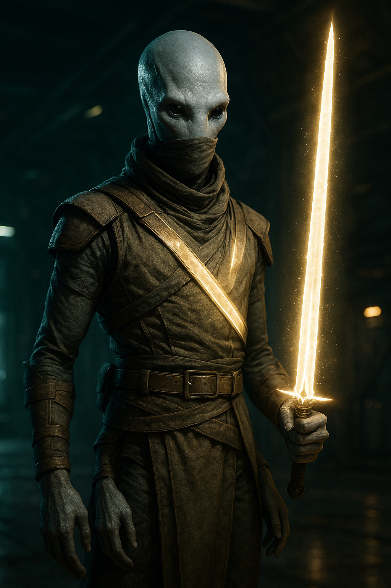

# Jehir Voloteo

| Classe/Livello | Razza | Tema |
|---|---|---|
| [[Solarian]] 8° | [[Kasatha]] | Icona (Car +1) |

| Taglia | Velocità | Genere | Mondo Natale |
|---|---|---|---|
| Media | 9 m | Maschio | Nato a bordo dell'[[Idari]], la nave generazionale kasatha |

| Allineamento | Divinità | Giocatore |
|---|---|---|
| Legale Neutrale | — (guerriero illuminato, non religioso in senso stretto) | *(da assegnare)* |

## Concept

Cresciuto a bordo dell'Idari tra rituali personali e racconti di eroi storici, Jehir ha intrapreso la propria *Tempra* — il tradizionale vagabondaggio kasatha di fine adolescenza — e non ha più smesso di viaggiare. Ha trovato nella disciplina solarian ciò che la sua cultura venera sopra ogni cosa: equilibrio, ciclicità, il duello come forma d'arte. Porta con sé un corpuscolo di energia stellare che plasma in lama quando serve, e tratta ogni combattimento serio come un momento quasi sacro — non per fede in un dio, ma per fede nel proprio posto nel ciclo cosmico.

Tema: **Icona** (Car +1) — la reputazione di Jehir come duellante lo precede in più di un porto franco; non la cerca attivamente, ma non la rifiuta nemmeno.

## Punteggi di Caratteristica

| | FOR | DES | COS | INT | SAG | CAR |
|---|---|---|---|---|---|---|
| **Punteggio** | 17 | 10 | 14 | 8 | 14 | 18 |
| **Modificatore** | +3 | +0 | +2 | –1 | +2 | +4 |

Generazione: base 10 → [[Kasatha]] (For +2, Sag +2, Int –2) → tema Icona (Car +1) → 10 punti spesi (Car +5, For +3, Cos +2) → base 1° livello For 15, Des 10, Cos 12, Int 8, Sag 12, Car 16 → aumento al 5° livello (+2 a For, Cos, Sag, Car, tutti ≤16) → valori finali sopra.

## Iniziativa

| Totale | = | Mod. Des | + | Varie |
|---|---|---|---|---|
| **+0** | = | +0 | + | 0 |

## Salute e Risolutezza

| | Punti Stamina | Punti Ferita | Punti Risolutezza |
|---|---|---|---|
| **Totale** | 72 | 60 | 8 |
| *Calcolo* | (7+2)×8 | 4 [[Kasatha]] + 7×8 [[Solarian]] | 4 (metà liv.) + 4 mod. Car |

## Classe Armatura

| | Totale | = | 10 + | Bonus Armatura | + | Mod. Des | + | Varie |
|---|---|---|---|---|---|---|---|---|
| **CAE** | 20 | = | 10 + | 10 | + | 0 | + | 0 |
| **CAC** | 20 | = | 10 + | 10 | + | 0 | + | 0 |

CA vs. Manovre di Combattimento = 8 + CAC = **28**. RD: nessuna. Resistenze: nessuna.

*Armatura: [[Equipaggiamento/Brigantina Vesk III|Brigantina Vesk III]] (leggera, Des Massimo +5, nessuna penalità). Nota: il bonus CA della [[Solarian#Manifestazione Solare|Manifestazione Solare]] (+1/+2 CAE/CAC) si applica solo scegliendo Armatura come manifestazione; Jehir ha scelto Arma, quindi non ne beneficia — compensato dal danno più alto in mischia.*

## Tiri Salvezza

| | Totale | = | Base | + | Mod. Caratteristica | + | Varie |
|---|---|---|---|---|---|---|---|
| **Tempra** (Cos) | +8 | = | +6 | + | +2 | + | 0 |
| **Riflessi** (Des) | +2 | = | +2 | + | +0 | + | 0 |
| **Volontà** (Sag) | +8 | = | +6 | + | +2 | + | 0 |

## Bonus di Attacco

| | Totale | = | BAB | + | Mod. Caratteristica | + | Varie |
|---|---|---|---|---|---|---|---|
| **Mischia** | +12 | = | +8 | + | +3 (For) | + | 1 (Arma Focalizzata) |
| **Distanza** | +8 | = | +8 | + | +0 (Des) | + | 0 |

## Armi

| Arma | Livello | Bonus Attacco | Danno | Critico | Speciale |
|---|---|---|---|---|---|
| [[Solarian#Arma Solare\|Arma Solare]] (manifestazione, aspetto luminoso) | 8 | +12 | 2d6+11 tagliente *(For +3, Arma Specializzata +8)* | — | Solo il Solarian può interagire con essa; si plasma/dissolve come azione di movimento |
| [[Equipaggiamento/Pistola d'Osso Classe Cripta\|Pistola d'Osso Classe Cripta]] (riserva) | 6 | +8 | 1d6 freddo | — | Arma di riserva per bersagli fuori portata |

## Abilità

Gradi di abilità per livello: 4 + mod. Int = 3. Abilità di classe ([[Solarian]]): Acrobazia, Atletica, Diplomazia, Furtività, Intimidire, Intuizione, Misticismo, Percezione, Professione, Scienza Fisica; più [[Cultura]] e [[Sopravvivenza]] da [[Solarian#Esperto nelle Abilità|Esperto nelle Abilità]]. Tabella completa, tutte le 20 abilità.

| Abilità | Gradi | Bonus Classe | Mod. | Varie | Totale |
|---|---|---|---|---|---|
| [[Acrobazia]] ☑ (Des) | 0 | — | +0 | +2 ([[Kasatha#Tratti Razziali\|Grazia Naturale]]) | **+2** |
| [[Atletica]] ☑ (For) | 8 | +3 | +3 | +2 (Grazia Naturale) | **+16** |
| [[Camuffare]] (Car) | 0 | — | +4 | — | **+4** |
| [[Computer]] (Int) | 0 | — | –1 | — | **–1** |
| [[Cultura]] ☑ (Int) | 8 | +3 | –1 | +2 ([[Kasatha#Tratti Razziali\|Storico]]) | **+12** |
| [[Diplomazia]] ☑ (Car) | 0 | — | +4 | — | **+4** |
| [[Furtività]] ☑ (Des) | 0 | — | +0 | — | **+0** |
| [[Ingegneria]] (Int) | 0 | — | –1 | — | **–1** |
| [[Intimidire]] ☑ (Car) | 8 | +3 | +4 | — | **+15** |
| [[Intuizione]] ☑ (Sag) | 0 | — | +2 | — | **+2** |
| [[Medicina]] (Int) | 0 | — | –1 | — | **–1** |
| [[Misticismo]] ☑ (Sag) | 0 | — | +2 | — | **+2** |
| [[Percezione]] ☑ (Sag) | 0 | — | +2 | — | **+2** |
| [[Pilotare]] (Des) | 0 | — | +0 | — | **+0** |
| [[Professione]] ☑ (Car — non specializzata) | 0 | — | +4 | — | **+4** |
| [[Raggirare]] (Car) | 0 | — | +4 | — | **+4** |
| [[Rapidità di Mano]] (Des) | 0 | — | +0 | — | **+0** |
| [[Scienza Biologica]] (Int) | 0 | — | –1 | — | **–1** |
| [[Scienza Fisica]] ☑ (Int) | 0 | — | –1 | — | **–1** |
| [[Sopravvivenza]] ☑ (Sag) | 0 | — | +2 | — | **+2** |

☑ = abilità di classe (bonus +3 se addestrata, richiede ≥1 grado; include le 2 abilità bonus da Esperto nelle Abilità). Il pool di gradi (24 totali) è interamente investito in Atletica, Intimidire e Cultura; le altre 17 abilità restano non addestrate ma sono mostrate per riferimento completo.

## Talenti e Competenze

**Competenze**: armature leggere; armi da mischia base e avanzate, armi piccole.

**Talenti** (1°, 3°, 5°, 7°): Arma Focalizzata (Mischia Avanzata), Iniziativa Migliorata, Tenacia, Schivare.
**Bonus di classe**: [[Solarian#Arma Specializzata (Str)|Arma Specializzata]] (mischia avanzata, 3°).

## Privilegi di Classe — Solarian

- **[[Solarian#Esperto nelle Abilità|Esperto nelle Abilità]]**: Cultura e Sopravvivenza aggiunte alle abilità di classe.
- **[[Solarian#Manifestazione Solare|Manifestazione Solare]]**: Arma (aspetto luminoso, tipo di danno tagliente) — vedi tabella Armi.
- **[[Solarian#Modalità Stellare (Sop)|Modalità Stellare]]**: in combattimento può armonizzarsi con i fotoni o i gravitoni, accumulando punti armonizzazione turno dopo turno.
- **Rivelazioni Stellari** (1° automatiche, poi 2°/4°/6°/8° = 4 scelte, bilanciate 3 fotoniche/3 gravitoniche incluse le automatiche):
  - [[Solarian/Rivelazioni#Buco Nero (Sop) {{Gravitonica}}|Buco Nero]] e [[Solarian/Rivelazioni#Supernova (Sop) {{Fotonica}}|Supernova]] (1°, automatiche)
  - [[Solarian/Rivelazioni#Radiazione (Sop) {{Fotonica}}|Radiazione]] (2°)
  - [[Solarian/Rivelazioni#Presa Gravitazionale (Sop) {{Gravitonica}}|Presa Gravitazionale]] (4°)
  - [[Solarian/Rivelazioni#Corona (Sop) {{Fotonica}}|Corona]] (6°)
  - [[Solarian/Rivelazioni#Forza Schiacciante (Sop) {{Gravitonica}}|Forza Schiacciante]] (8°)
- **[[Solarian#Colpi Lampanti (Str)|Colpi Lampanti]]**: in un attacco completo solo in mischia, penalità –3 invece di –4.

## Equipaggiamento

| Oggetto | Livello | Ingombro |
|---|---|---|
| [[Equipaggiamento/Brigantina Vesk III\|Brigantina Vesk III]] | 8 | 2 |
| [[Equipaggiamento/Pistola d'Osso Classe Cripta\|Pistola d'Osso Classe Cripta]] | 6 | L |

**Crediti**: 350 (liquidi — il resto della ricchezza iniziale è già investito nell'equipaggiamento sopra; Jehir vive con quasi nulla, per scelta di tradizione). **Ingombro Totale**: 2.

## Lingue

Comune, Kasatha.

## Tratti Razziali (Kasatha)

Vedi [[Kasatha]] per il testo completo. In sintesi: Umanoide di taglia Media, PF razziali 4, Andatura nel Deserto (nessuna penalità di movimento su terreni difficili desertici/collinari/montani), Quattro Braccia (può impugnare il doppio degli oggetti, non attacchi extra), Storico (+2 Cultura), Grazia Naturale (+2 Acrobazia/Atletica).

## Personalità e interpretazione

Formale, quasi cerimonioso, con un codice personale di condotta che segue più rigidamente di qualsiasi legge esterna. Copre la bocca in pubblico davanti a chi non considera un intimo, secondo l'usanza kasatha, e questo lo rende inizialmente distante agli occhi di chi non conosce la cultura. Rispetta profondamente chi dimostra disciplina o abilità in combattimento, a prescindere dalla razza o dal ruolo — è così che giudica il valore di uno sconosciuto. In battaglia trova una chiarezza quasi meditativa; fuori dal combattimento, osserva più di quanto parli.

### Spunti rapidi per l'interprete

- **Tic**: si copre la bocca in pubblico davanti a chi non considera un intimo — un gesto quasi automatico, non calcolato.
- **Sotto pressione**: trova chiarezza quasi meditativa — più calmo, non più agitato, specialmente in combattimento.
- **Con il party**: rispetto quasi da pari con [[kesh-vantor|Kesh Vantor]] — la loro è una rivalità amichevole fondata sul valore dimostrato in battaglia.

## Note per il GM

- Scheda costruita con le regole di [[Solarian]] e [[Kasatha]] da [[wiki/regole/indice-regolamento|regolamento]] locale, formattata secondo lo standard descritto in `CLAUDE.md`.
- Creato come alternativa di scelta per i giocatori, insieme a [[pg/keskodai|Keskodai]]: copre un ruolo — danno da mischia puro con un sottosistema di risorse a turni (Modalità Stellare) — distinto sia da Kesh Vantor (soldato "always-on", senza gestione di risorse) sia dal resto del party.
- `fazioni` vuoto: Jehir è ancora tecnicamente un girovago in *Tempra* perenne.
- Unico campo lasciato volutamente aperto: `giocatore`.
