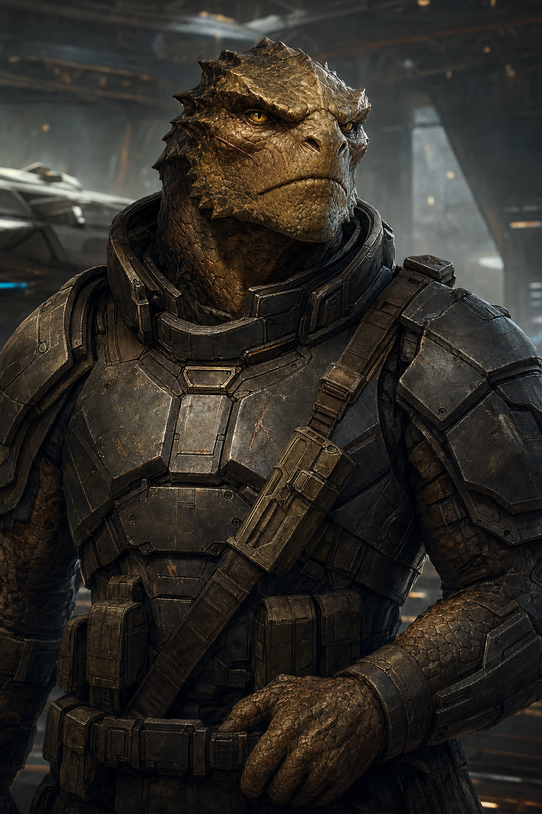

# Kesh Vantor

| Classe/Livello | Razza | Tema |
|---|---|---|
| [[Soldato]] 8° | [[Vesk]] | Mercenario (For +1) |

| Taglia | Velocità | Genere | Mondo Natale |
|---|---|---|---|
| Media | 6 m (armatura pesante) | Maschio | Vesk-12, mondo colonia del [[Veskarium]] |

| Allineamento | Divinità | Giocatore |
|---|---|---|
| Legale Neutrale | — | *(da assegnare)* |

## Concept

Kesh ha lasciato il [[Veskarium]] non per rigetto della sua cultura guerriera, ma perché la cercava altrove: un vesk che crede ancora fermamente in onore, prova di sé in battaglia e lealtà verso i compagni, ma che non ha trovato nel proprio impero avversari "degni" da anni. Si è arruolato come mercenario, poi come avventuriero, sempre alla ricerca dello scontro che meriti davvero il nome. Diretto, taciturno con gli estranei, capace di scoppi di affetto sorprendenti verso chi si è guadagnato la sua fiducia.

## Punteggi di Caratteristica

| | FOR | DES | COS | INT | SAG | CAR |
|---|---|---|---|---|---|---|
| **Punteggio** | 19 | 14 | 17 | 8 | 12 | 10 |
| **Modificatore** | +4 | +2 | +3 | –1 | +1 | +0 |

Generazione: base 10 → [[Vesk]] (For +2, Cos +2, Int –2) → tema Mercenario (For +1) → 10 punti spesi (For +5, Cos +3, Des +2) → base 1° livello For 18, Des 12, Cos 15, Int 8, Sag 10, Car 10 → aumento al 5° livello (+1 a For, essendo ≥17; +2 a Cos, Des, Sag, essendo ≤16) → valori finali sopra.

## Iniziativa

| Totale | = | Mod. Des | + | Varie |
|---|---|---|---|---|
| **+6** | = | +2 | + | +4 (Iniziativa Migliorata) |

## Salute e Risolutezza

| | Punti Stamina | Punti Ferita | Punti Risolutezza |
|---|---|---|---|
| **Totale** | 80 | 62 | 8 |
| *Calcolo* | (7+3)×8 | 6 [[Vesk]] + 7×8 [[Soldato]] | 4 (metà liv.) + 4 mod. For |

## Classe Armatura

| | Totale | = | 10 + | Bonus Armatura | + | Mod. Des | + | Varie |
|---|---|---|---|---|---|---|---|---|
| **CAE** | 26 | = | 10 + | 13 | + | 2 | + | 1 (Esperto nelle Armature) |
| **CAC** | 28 | = | 10 + | 15 | + | 2 | + | 1 (Esperto nelle Armature) |

CA vs. Manovre di Combattimento = 8 + CAC = **36**. RD: nessuna. Resistenze: nessuna.

*Armatura: [[Equipaggiamento/Sovracorazza Vesk II|Sovracorazza Vesk II]] (pesante, Des Massimo +2, penalità alle prove –3 ridotta a –2 dal tratto razziale [[Vesk#Tratti Razziali|Esperto nelle Armature]]).*

## Tiri Salvezza

| | Totale | = | Base | + | Mod. Caratteristica | + | Varie |
|---|---|---|---|---|---|---|---|
| **Tempra** (Cos) | +9 | = | +6 | + | +3 | + | 0 |
| **Riflessi** (Des) | +4 | = | +2 | + | +2 | + | 0 |
| **Volontà** (Sag) | +7 | = | +6 | + | +1 | + | 0 |

Bonus razziale [[Vesk|Vesk]] +2 ai TS contro la paura (non incluso sopra).

## Bonus di Attacco

| | Totale | = | BAB | + | Mod. Caratteristica | + | Varie |
|---|---|---|---|---|---|---|---|
| **Mischia** | +13 | = | +8 | + | +4 (For) | + | 1 (Arma Focalizzata) |
| **Distanza** | +10 | = | +8 | + | +2 (Des) | + | 0 |

## Armi

| Arma | Livello | Bonus Attacco | Danno | Critico | Speciale |
|---|---|---|---|---|---|
| [[Equipaggiamento/Doshko Avanzato\|Doshko Avanzato]] | 7 | +13 | 2d12+12 *(Str +4, Arma Specializzata +8)* | — | Analogico, Ingombrante, a Due Mani |

## Abilità

Gradi di abilità per livello: 4 + mod. Int = 3. Abilità di classe ([[Soldato]]): Acrobazia, Atletica, Ingegneria, Intimidire, Intuizione, Medicina, Pilotare, Professione, Sopravvivenza. Tabella completa, tutte le 20 abilità.

| Abilità | Gradi | Bonus Classe | Mod. | Varie | Totale |
|---|---|---|---|---|---|
| [[Acrobazia]] ☑ (Des) | 0 | — | +2 | — | **+2** |
| [[Atletica]] ☑ (For) | 8 | +3 | +4 | — | **+15** |
| [[Camuffare]] (Car) | 0 | — | +0 | — | **+0** |
| [[Computer]] (Int) | 0 | — | –1 | — | **–1** |
| [[Cultura]] (Int) | 0 | — | –1 | — | **–1** |
| [[Diplomazia]] (Car) | 0 | — | +0 | — | **+0** |
| [[Furtività]] (Des) | 0 | — | +2 | — | **+2** |
| [[Ingegneria]] ☑ (Int) | 0 | — | –1 | — | **–1** |
| [[Intimidire]] ☑ (Car) | 8 | +3 | +0 | — | **+11** |
| [[Intuizione]] ☑ (Sag) | 8 | +3 | +1 | — | **+12** |
| [[Medicina]] ☑ (Int) | 0 | — | –1 | — | **–1** |
| [[Misticismo]] (Sag) | 0 | — | +1 | — | **+1** |
| [[Percezione]] (Sag) | 0 | — | +1 | — | **+1** |
| [[Pilotare]] ☑ (Des) | 0 | — | +2 | — | **+2** |
| [[Professione]] ☑ (Sag — non specializzata) | 0 | — | +1 | — | **+1** |
| [[Raggirare]] (Car) | 0 | — | +0 | — | **+0** |
| [[Rapidità di Mano]] (Des) | 0 | — | +2 | — | **+2** |
| [[Scienza Biologica]] (Int) | 0 | — | –1 | — | **–1** |
| [[Scienza Fisica]] (Int) | 0 | — | –1 | — | **–1** |
| [[Sopravvivenza]] ☑ (Sag) | 0 | — | +1 | — | **+1** |

☑ = abilità di classe (bonus +3 se addestrata, richiede ≥1 grado). Il pool di gradi (24 totali) è interamente investito in Atletica, Intimidire e Intuizione; le altre 17 abilità restano non addestrate ma sono mostrate per riferimento completo.

## Talenti e Competenze

**Competenze**: armature leggere e pesanti; armi da mischia base e avanzate, armi di precisione, lunghe, pesanti, piccole, granate ([[Soldato]]).

**Talenti** (1°, 3°, 5°, 7°): Iniziativa Migliorata, Tenacia, Colpo Poderoso, Schivare.
**Talenti di Combattimento bonus** (2°, 4°, 6°, 8°, da [[Soldato]]): Arma Focalizzata (Mischia Avanzata), Critico Migliorato (Doshko), Attacco Sfondante, Resistenza alle Manovre.
**Bonus di classe**: [[Soldato#Arma Specializzata (Str)|Arma Specializzata]] (tutti i tipi di arma in cui è competente).

## Privilegi di Classe — Soldato

- **Stile di Combattimento Primario: [[Soldato/Stili#Guerriero Provetto|Guerriero Provetto]]** *(richiede i tratti razziali vesk Esperto nelle Armature e Armi Naturali — soddisfatti)*
  - **Rinforzare Resilienza** (1°, RD 2/– per un numero di round pari al mod. For, 1/riposo)
  - **Colpo Istintivo** (5°, +1 al prossimo attacco in mischia contro un bersaglio studiato)
- **[[Soldato#Massacro del Soldato (Str)|Massacro del Soldato]]**: non ancora ottenuto (11° livello)

## Equipaggiamento

| Oggetto | Livello | Ingombro |
|---|---|---|
| [[Equipaggiamento/Sovracorazza Vesk II\|Sovracorazza Vesk II]] | 8 | 3 |
| [[Equipaggiamento/Doshko Avanzato\|Doshko Avanzato]] | 7 | 1 |

**Crediti**: 200 (liquidi — il resto della ricchezza iniziale è già investito nell'equipaggiamento sopra; Kesh spende quasi tutto in equipaggiamento di qualità, poco gli interessa accumulare). **Ingombro Totale**: 4.

## Lingue

Comune, Vesk.

## Tratti Razziali (Vesk)

Vedi [[Vesk]] per il testo completo. In sintesi: Umanoide di taglia Media, PF razziali 6, Esperto nelle Armature (+1 CA con armatura, –1 penalità armature pesanti — già applicato sopra), Temerarietà (+2 TS paura), Visione Crepuscolare, Armi Naturali (colpo senz'armi non arcaico, Arma Specializzata unica al 3° livello).

## Personalità e interpretazione

Formale e diretto, valuta gli altri in base al valore dimostrato in combattimento e al rispetto della parola data, non per lignaggio o ricchezza. Con gli sconosciuti è taciturno fino alla ruvidezza; con chi si è guadagnato la sua fiducia mostra una lealtà totale e, di rado ma inequivocabilmente, momenti di calore quasi imbarazzato per lui stesso. Cerca ancora lo scontro "degno" che non ha mai trovato in patria — un tema che il GM può sfruttare facendogli incontrare avversari che lo mettano davvero alla prova, come [[nemici/ordito|l'Ordito]].

## Note per il GM

- Scheda costruita con le regole di [[Soldato]] e [[Vesk]] da [[wiki/regole/indice-regolamento|regolamento]] locale, formattata secondo lo standard descritto in `CLAUDE.md` (vedi [[wiki/pg/vela-9|Vela-9]] come modello).
- Mondo natale, luogo attuale e crediti completati dall'agente per coerenza narrativa, trattandosi di una one-shot. Unico campo lasciato volutamente aperto: `giocatore`, da assegnare quando si forma il tavolo.
- `fazioni` vuoto: Kesh ha lasciato il Veskarium, nessuna affiliazione attiva.
