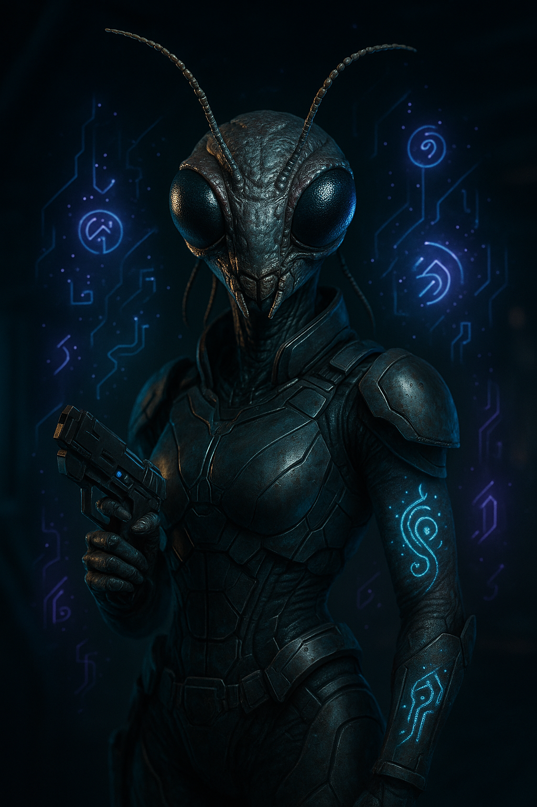

# Keskodai

| Classe/Livello | Razza | Tema |
|---|---|---|
| [[Tecnomante]] 8° | [[Shirren]] | [[Erudito]] (Scienza Fisica) |

| Taglia | Velocità | Genere | Mondo Natale |
|---|---|---|---|
| Media | 9 m | Femmina | Colonia di Yamere, enclave shirren extra-sistema |

| Allineamento | Divinità | Giocatore |
|---|---|---|
| Legale Buono | — | *(da assegnare)* |

## Concept

Nata generazioni dopo la scissione dallo Sciame, Keskodai ha ereditato la fame collettiva dei suoi antenati e l'ha trasformata in qualcosa di completamente diverso: una fame di sapere. Trova nella tecnomanzia — la fusione impossibile di magia e tecnologia — la stessa vertigine che i suoi simili descrivono nell'esercizio del libero arbitrio: ogni incantesimo hackerato è una piccola scelta radicale, un atto di individualità che nessuno Sciame potrebbe mai concepire. Comunica più volentieri per via telepatica che a voce, e il suo umorismo secco spesso passa inosservato a chi non riesce a "sentirla" chiaramente.

Tema: **[[Erudito]]** (specializzazione: [[Scienza Fisica]]) — prima ancora di diventare tecnomante, Keskodai era già una studiosa ossessiva: la tecnomanzia è stata semplicemente la disciplina più affascinante in cui applicare quell'ossessione.

## Punteggi di Caratteristica

| | FOR | DES | COS | INT | SAG | CAR |
|---|---|---|---|---|---|---|
| **Punteggio** | 10 | 15 | 16 | 18 | 14 | 8 |
| **Modificatore** | +0 | +2 | +3 | +4 | +2 | –1 |

Generazione: base 10 → [[Shirren]] (Cos +2, Sag +2, Car –2) → tema Erudito (Int +1) → 10 punti spesi (Int +5, Des +3, Cos +2) → base 1° livello For 10, Des 13, Cos 14, Int 16, Sag 12, Car 8 → aumento al 5° livello (+2 a Int, Des, Cos, Sag, tutti ≤16) → valori finali sopra.

## Iniziativa

| Totale | = | Mod. Des | + | Varie |
|---|---|---|---|---|
| **+6** | = | +2 | + | +4 (Iniziativa Migliorata) |

## Salute e Risolutezza

| | Punti Stamina | Punti Ferita | Punti Risolutezza |
|---|---|---|---|
| **Totale** | 64 | 46 | 8 |
| *Calcolo* | (5+3)×8 | 6 [[Shirren]] + 5×8 [[Tecnomante]] | 4 (metà liv.) + 4 mod. Int |

## Classe Armatura

| | Totale | = | 10 + | Bonus Armatura | + | Mod. Des | + | Varie |
|---|---|---|---|---|---|---|---|---|
| **CAE** | 21 | = | 10 + | 9 | + | 2 | + | 0 |
| **CAC** | 23 | = | 10 + | 11 | + | 2 | + | 0 |

CA vs. Manovre di Combattimento = 8 + CAC = **31**. RD: nessuna. Resistenze: nessuna.

*Armatura: [[Equipaggiamento/Microtessuto Kasatha III|Microtessuto Kasatha III]] (leggera, Des Massimo +5, penalità alle prove –1).*

## Tiri Salvezza

| | Totale | = | Base | + | Mod. Caratteristica | + | Varie |
|---|---|---|---|---|---|---|---|
| **Tempra** (Cos) | +5 | = | +2 | + | +3 | + | 0 |
| **Riflessi** (Des) | +4 | = | +2 | + | +2 | + | 0 |
| **Volontà** (Sag) | +8 | = | +6 | + | +2 | + | 0 |

## Bonus di Attacco

| | Totale | = | BAB | + | Mod. Caratteristica | + | Varie |
|---|---|---|---|---|---|---|---|
| **Mischia** | +6 | = | +6 | + | +0 (For) | + | 0 |
| **Distanza** | +8 | = | +6 | + | +2 (Des) | + | 0 |

## Armi

| Arma | Livello | Bonus Attacco | Danno | Critico | Gittata | Tipo | Munizioni | Speciale |
|---|---|---|---|---|---|---|---|---|
| [[Equipaggiamento/Modulatore d'Onda III\|Modulatore d'Onda III]] | 8 | +8 | 2d4+8 *(Arma Specializzata)* | — | 9 m | Fu o So | 20 cariche (4/colpo) | Modale (Sonico) |

## Abilità

Gradi di abilità per livello: 4 + mod. Int = 8. Abilità di classe ([[Tecnomante]]): Computer, Ingegneria, Misticismo, Pilotare, Professione, Rapidità di Mano, Scienza Biologica, Scienza Fisica. Tabella completa, tutte le 20 abilità.

| Abilità | Gradi | Bonus Classe | Mod. | Varie | Totale |
|---|---|---|---|---|---|
| [[Acrobazia]] (Des) | 0 | — | +2 | — | **+2** |
| [[Atletica]] (For) | 0 | — | +0 | — | **+0** |
| [[Camuffare]] (Car) | 0 | — | –1 | — | **–1** |
| [[Computer]] ☑ (Int) | 8 | +3 | +4 | +2 ([[Tecnomante#Sapienza Tecnica (Str)\|Sapienza Tecnica]]) | **+17** |
| [[Cultura]] (Int) | 0 | — | +4 | +2 ([[Shirren#Tratti Razziali\|Passione per le Culture]]) | **+6** |
| [[Diplomazia]] (Car) | 0 | — | –1 | +2 (Passione per le Culture) | **+1** |
| [[Furtività]] (Des) | 0 | — | +2 | — | **+2** |
| [[Ingegneria]] ☑ (Int) | 8 | +3 | +4 | — | **+15** |
| [[Intimidire]] (Car) | 0 | — | –1 | — | **–1** |
| [[Intuizione]] (Sag) | 0 | — | +2 | — | **+2** |
| [[Medicina]] (Int) | 0 | — | +4 | — | **+4** |
| [[Misticismo]] ☑ (Sag) | 8 | +3 | +2 | +2 (Sapienza Tecnica) | **+15** |
| [[Percezione]] (Sag) | 0 | — | +2 | — | **+2** |
| [[Pilotare]] ☑ (Des) | 8 | +3 | +2 | — | **+13** |
| [[Professione]] ☑ (Int — Tecnomante Freelance) | 8 | +3 | +4 | — | **+15** |
| [[Raggirare]] (Car) | 0 | — | –1 | — | **–1** |
| [[Rapidità di Mano]] ☑ (Des) | 8 | +3 | +2 | — | **+13** |
| [[Scienza Biologica]] ☑ (Int) | 8 | +3 | +4 | — | **+15** |
| [[Scienza Fisica]] ☑ (Int) | 8 | +3 | +4 | — | **+15** *(CD ricordare conoscenze –5, [[Erudito]])* |
| [[Sopravvivenza]] (Sag) | 0 | — | +2 | — | **+2** |

☑ = abilità di classe (bonus +3 se addestrata, richiede ≥1 grado). 8 abilità addestrate (64 gradi, pool esaurito esattamente), 12 non addestrate mostrate per riferimento completo. Bonus razziale [[Shirren#Tratti Razziali|Passione per le Culture]] (+2 Cultura/Diplomazia) applicato anche da non addestrata.

## Talenti e Competenze

**Competenze**: armature leggere; armi da mischia base, armi piccole.

**Talenti** (1°, 3°, 5°, 7°): Iniziativa Migliorata, Tenacia, Robustezza, Sinergia dell'Abilità.
**Bonus di classe**: [[Tecnomante#Arma Specializzata (Str)|Arma Specializzata]] (armi da mischia base, armi piccole, 3°), [[Tecnomante#Incantesimi Focalizzati|Incantesimi Focalizzati]] (3°).

## Privilegi di Classe — Tecnomante

- **[[Tecnomante#Cache di Incantesimi (Sop)|Cache di Incantesimi]]**: un tatuaggio bioluminescente sull'addome — 1/giorno può lanciare un incantesimo conosciuto anche a corto di slot.
- **[[Tecnomante#Sapienza Tecnica (Str)|Sapienza Tecnica]]** +2 (Computer, Misticismo)
- **Hackeraggi Magici** (2°, 5°, 8° = 3 totali): [[Tecnomante/Hackeraggi#Incantesimo Energetico (Str)|Incantesimo Energetico]] (2°), [[Tecnomante/Hackeraggi#Controtecnologia (Sop)|Controtecnologia]] (5°), [[Tecnomante/Hackeraggi#Calcolare Traiettoria (Str)|Calcolare Traiettoria]] (8°)

## Incantesimi

**Incantesimi al giorno** (livello 8): 1°–4, 2°–4, 3°–2 (più 0° a volontà). **Incantesimi conosciuti**: 0°–6, 1°–5, 2°–4, 3°–3. CD dei Tiri Salvezza contro i suoi incantesimi = 10 + livello incantesimo + 4 (mod. Int).

| Livello | Incantesimi |
|---|---|
| 0° (6, a volontà) | [[Raggio di Energia]], [[Individuazione del Magico]], [[Individuazione dell'Afflizione]], [[Riparare]], [[Trasferire Carica]], [[Messaggio Telepatico]] |
| 1° (5) | [[Dardo Incantato]], [[Immagine Olografica]], [[Individuazione della Tecnologia]], [[Scansione Ambientale]], [[Convocare Creatura]] |
| 2° (4) | [[Invisibilità]], [[Manipolare Tecnologia]], [[Immagine Speculare]], [[Vedere Invisibilità]] |
| 3° (3) | [[Dissolvi Magie]], [[Vista Arcana]], [[Lama di Rottami]] |

## Equipaggiamento

| Oggetto | Livello | Ingombro |
|---|---|---|
| [[Equipaggiamento/Microtessuto Kasatha III\|Microtessuto Kasatha III]] | 8 | 1 |
| [[Equipaggiamento/Modulatore d'Onda III\|Modulatore d'Onda III]] | 8 | L |
| Cache di Incantesimi (tatuaggio bioluminescente) | — | — |

**Crediti**: 400 (liquidi — il resto della ricchezza iniziale è già investito nell'equipaggiamento sopra; Keskodai spende quasi tutto in componenti e letteratura tecnomantica). **Ingombro Totale**: 1.

## Lingue

Comune, Shirren, più lingue aggiuntive a scelta. Telepatia limitata (9 m, con creature che condividono un linguaggio).

## Tratti Razziali (Shirren)

Vedi [[Shirren]] per il testo completo. In sintesi: Umanoide di taglia Media, PF razziali 6, Percezione Cieca (vibrazione) 9 m, Comunitarismo (1/giorno un alleato entro 3 m tira due volte un attacco o una prova d'abilità e sceglie il migliore), Passione per le Culture (+2 Cultura/Diplomazia), Telepatia Limitata 9 m.

## Personalità e interpretazione

Analitica fino all'ironia, tratta quasi ogni situazione come un problema da hackerare — incluse le conversazioni. Il suo umorismo è secco, spesso criptico, e arriva più naturalmente via telepatia che a voce. Nonostante l'individualismo shirren, porta con sé un residuo di istinto comunitario: si getta senza esitazione in situazioni pericolose per proteggere il gruppo, un comportamento che lei stessa fatica a spiegare del tutto razionalmente.

### Spunti rapidi per l'interprete

- **Tic**: preferisce comunicare per via telepatica anche quando parlare a voce sarebbe più semplice, specie con chi conosce bene.
- **Sotto pressione**: diventa più fredda e clinica nell'analisi — un contrasto netto col suo umorismo abituale.
- **Con il party**: scambia spesso osservazioni tecniche/mistiche con [[naeva-thess|Naeva Thess]], per cui nutre una genuina curiosità intellettuale.

## Note per il GM

- Scheda costruita con le regole di [[Tecnomante]] e [[Shirren]] da [[wiki/regole/indice-regolamento|regolamento]] locale, formattata secondo lo standard descritto in `CLAUDE.md`.
- Creata come alternativa di scelta per i giocatori, insieme a [[pg/jehir-voloteo|Jehir Voloteo]]: copre un ruolo — danno magico offensivo/controllo — non coperto dagli altri PG del party (Naeva Thess è orientata alla cura, non all'attacco).
- `fazioni` vuoto: Keskodai opera come freelance indipendente.
- Unico campo lasciato volutamente aperto: `giocatore`.
