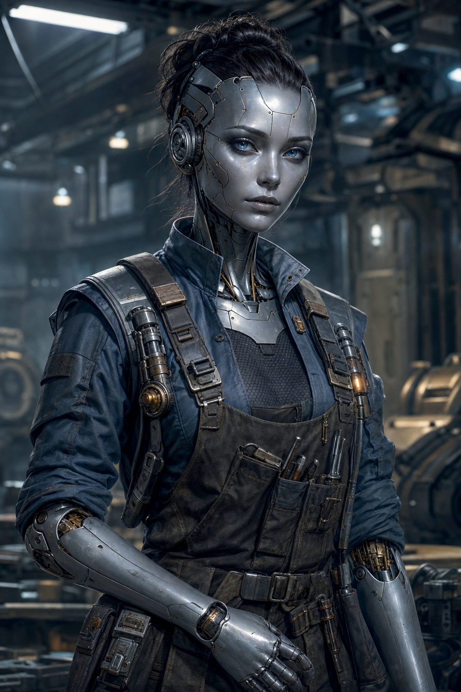
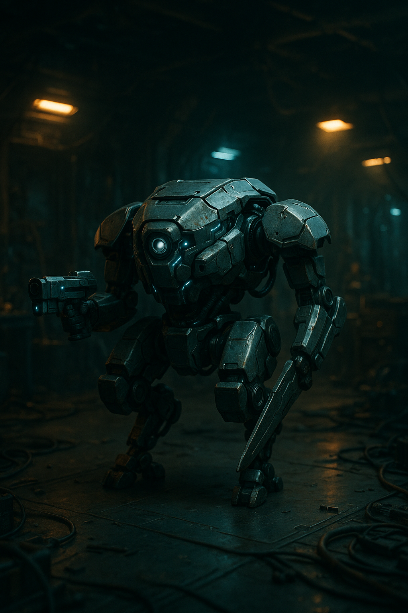

# Vela-9

| Classe/Livello | Razza | Tema |
|---|---|---|
| [[Meccanico]] 8° | [[Androide]] | [[Erudito]] (Scienza Fisica) |

| Taglia | Velocità | Genere | Mondo Natale |
|---|---|---|---|
| Media | 9 m | Femmina (scelta) | Fonderia Halvenn, stazione orbitale extra-sistema |

| Allineamento | Divinità | Giocatore |
|---|---|---|
| Neutrale | — | *(da assegnare)* |

## Concept

Vela-9 è un'androide costruita per il lavoro industriale, emancipatasi come tutta la sua specie ma mai davvero a suo agio tra gli organici. Trova nella tecnologia una logica limpida che le relazioni sociali non le hanno mai offerto: il legame più stretto della sua esistenza non è con una persona, ma con **Unità-Falco**, il drone da combattimento che ha costruito e programmato di persona. Le sue [[Androide#Tratti Razziali|emozioni sopite]] non significano assenza di sentimento — significa che li elabora più lentamente, e li affida più volentieri a una macchina che capisce di aver creato lei stessa piuttosto che a un'altra coscienza che non può controllare.

Tema: **[[Erudito]]** (specializzazione: [[Scienza Fisica]]) — Vela-9 studia fisica applicata e ingegneria energetica non per obbligo, ma perché comprendere come funziona l'universo è l'unico tipo di intimità che le viene naturale.

## Punteggi di Caratteristica

| | FOR | DES | COS | INT | SAG | CAR |
|---|---|---|---|---|---|---|
| **Punteggio** | 10 | 16 | 17 | 18 | 12 | 8 |
| **Modificatore** | +0 | +3 | +3 | +4 | +1 | –1 |

Generazione: acquisto punti. Base 10 in tutto → [[Androide]] (Des +2, Int +2, Car –2) → [[Erudito]] (Int +1) → 10 punti spesi (Int +3, Des +2, Cos +5) → base 1° livello For 10, Des 14, Cos 15, Int 16, Sag 10, Car 8 → aumento di caratteristiche al 5° livello (+2 a Int, Des, Cos, Sag, tutti ≤16) → valori finali sopra.

## Iniziativa

| Totale | = | Mod. Des | + | Varie |
|---|---|---|---|---|
| **+7** | = | +3 | + | +4 (Iniziativa Migliorata) |

## Salute e Risolutezza

| | Punti Stamina | Punti Ferita | Punti Risolutezza |
|---|---|---|---|
| **Totale** | 72 | 52 | 8 |
| *Calcolo* | (6+3)×8 | 4 [[Androide]] + 6×8 [[Meccanico]] | 4 (metà liv.) + 4 mod. Int |

## Classe Armatura

| | Totale | = | 10 + | Bonus Armatura | + | Mod. Des | + | Varie |
|---|---|---|---|---|---|---|---|---|
| **CAE** | 22 | = | 10 + | 9 | + | 3 | + | 0 |
| **CAC** | 23 | = | 10 + | 10 | + | 3 | + | 0 |

CA vs. Manovre di Combattimento = 8 + CAC = **31**. RD: nessuna (a mani nude). Resistenze: nessuna.

*Armatura: [[Equipaggiamento/Tessuto Termico Lashunta Avanzato|Tessuto Termico Lashunta Avanzato]] (Des Massimo +6, nessuna penalità alle prove).*

## Tiri Salvezza

| | Totale | = | Base | + | Mod. Caratteristica | + | Varie |
|---|---|---|---|---|---|---|---|
| **Tempra** (Cos) | +9 | = | +6 | + | +3 | + | 0 |
| **Riflessi** (Des) | +9 | = | +6 | + | +3 | + | 0 |
| **Volontà** (Sag) | +3 | = | +2 | + | +1 | + | 0 |

Bonus razziale [[Androide|Androide]] +2 ai TS contro malattie, effetti di influenza mentale, veleni e sonno (non incluso sopra, si applica solo quando pertinente).

## Bonus di Attacco

| | Totale | = | BAB | + | Mod. Caratteristica | + | Varie |
|---|---|---|---|---|---|---|---|
| **Mischia** | +6 | = | +6 | + | +0 (For) | + | 0 |
| **Distanza** | +10 | = | +6 | + | +3 (Des) | + | 1 (Arma Focalizzata) |
| **Lancio** | +6 | = | +6 | + | +0 (For) | + | 0 |

## Armi

| Arma | Livello | Bonus Attacco | Danno | Critico | Gittata | Tipo | Munizioni | Speciale |
|---|---|---|---|---|---|---|---|---|
| [[Equipaggiamento/Modulatore d'Onda III\|Modulatore d'Onda III]] | 8 | +10 | 2d4 | — | 9 m | Fu o So | 20 cariche (4/colpo) | Modale (Sonico) |

## Abilità

Gradi di abilità per livello: 4 + mod. Int = 8. Abilità di classe ([[Meccanico]]): Atletica, Computer, Ingegneria, Medicina, Percezione, Pilotare, Professione; più Scienza Fisica da [[Erudito]]. Tabella completa, tutte le 20 abilità.

| Abilità | Gradi | Bonus Classe | Mod. | Varie | Totale |
|---|---|---|---|---|---|
| [[Acrobazia]] (Des) | 0 | — | +3 | — | **+3** |
| [[Atletica]] ☑ (For) | 8 | +3 | +0 | — | **+11** |
| [[Camuffare]] (Car) | 0 | — | –1 | — | **–1** |
| [[Computer]] ☑ (Int) | 8 | +3 | +4 | +2 ([[Meccanico#Bypassare (Str)\|Bypassare]]) | **+17** |
| [[Cultura]] (Int) | 0 | — | +4 | — | **+4** |
| [[Diplomazia]] (Car) | 0 | — | –1 | — | **–1** |
| [[Furtività]] (Des) | 0 | — | +3 | — | **+3** |
| [[Ingegneria]] ☑ (Int) | 8 | +3 | +4 | +2 (Bypassare) | **+17** |
| [[Intimidire]] (Car) | 0 | — | –1 | — | **–1** |
| [[Intuizione]] (Sag) | 0 | — | +1 | –2 ([[Androide#Tratti Razziali\|Emozioni Sopite]]) | **–1** *(ma CD per leggerla +2)* |
| [[Medicina]] ☑ (Int) | 8 | +3 | +4 | — | **+15** |
| [[Misticismo]] (Sag) | 0 | — | +1 | — | **+1** |
| [[Percezione]] ☑ (Sag) | 8 | +3 | +1 | — | **+12** |
| [[Pilotare]] ☑ (Des) | 8 | +3 | +3 | — | **+14** |
| [[Professione]] ☑ (Int — Ingegnere) | 8 | +3 | +4 | — | **+15** |
| [[Raggirare]] (Car) | 0 | — | –1 | — | **–1** |
| [[Rapidità di Mano]] (Des) | 0 | — | +3 | — | **+3** |
| [[Scienza Biologica]] (Int) | 0 | — | +4 | — | **+4** |
| [[Scienza Fisica]] ☑ (Int) | 8 | +3 | +4 | — | **+15** *(CD ricordare conoscenze –5, [[Erudito]])* |
| [[Sopravvivenza]] (Sag) | 0 | — | +1 | — | **+1** |

☑ = abilità di classe (bonus +3 se addestrata, richiede ≥1 grado). 8 abilità addestrate (64 gradi, pool esaurito esattamente), 12 non addestrate mostrate comunque per riferimento completo.

## Talenti e Competenze

**Competenze**: armature leggere; armi da mischia base, armi piccole, granate ([[Meccanico]]).

**Talenti**:
1. Iniziativa Migliorata (1°)
2. Abilità Focalizzata (Ingegneria) (3°)
3. Arma Focalizzata (armi piccole) (5°)
4. Tenacia (7°)
5. [[Meccanico#Arma Specializzata (Str)|Arma Specializzata]] (armi piccole) — talento bonus di classe (3°)

## Privilegi di Classe — Meccanico

- **[[Meccanico#Attrezzatura Personalizzata (Str)|Attrezzatura Personalizzata]]**: installata come impianto cibernetico nel cervello.
- **[[Meccanico#Bypassare (Str)|Bypassare]]** +2 (Computer, Ingegneria)
- **[[Meccanico#Intelligenza Artificiale (Str)|Intelligenza Artificiale]]**: Drone (vedi sotto)
- **[[Meccanico#Sovraccarico (Str)|Sovraccarico]]**
- **[[Meccanico#Hackeraggio Remoto (Str)|Hackeraggio Remoto]]** (12 m)
- **[[Meccanico#Attrezzatura Specializzata (Str)|Attrezzatura Specializzata]]**
- **[[Meccanico#Esperto Senza Pari (Str)|Esperto Senza Pari]]** 1/giorno
- **Trucchi del Meccanico**: [[Meccanico/Trucchi#Riparare Drone (Str)|Riparare Drone]] (2°), [[Meccanico/Trucchi#Medico Tecnologico (Str)|Medico Tecnologico]] (4°), [[Meccanico/Trucchi#Manutenzione in Combattimento (Str)|Manutenzione in Combattimento]] (6°), [[Meccanico/Trucchi#Unirsi al Drone (Str)|Unirsi al Drone]] (8°)

Nota di lore: **Medico Tecnologico** le permette di usare [[Ingegneria]] al posto di [[Medicina]] per riparare androidi e costrutti — Vela-9 può letteralmente "curare" i propri simili, e in senso lato se stessa, con gli stessi strumenti con cui ripara Unità-Falco.

## Equipaggiamento

| Oggetto | Livello | Ingombro |
|---|---|---|
| [[Equipaggiamento/Tessuto Termico Lashunta Avanzato\|Tessuto Termico Lashunta Avanzato]] | 8 | L |
| [[Equipaggiamento/Modulatore d'Onda III\|Modulatore d'Onda III]] | 8 | L |
| Attrezzatura Personalizzata (impianto cibernetico) | — | — |
| Unità-Falco (drone da combattimento) | — | — |

**Crediti**: 350 (liquidi — il resto della ricchezza iniziale è già investito nell'equipaggiamento sopra; Vela-9 non tiene molto contante, preferisce reinvestire in pezzi di ricambio). **Ingombro Totale**: L (leggero).

## Lingue

Comune, più lingue aggiuntive a scelta pari al mod. Int (fino a 4).

## Unità-Falco — il Drone

Telaio: **Drone da Combattimento**, taglia Media, IA di livello 8.

| PF | BAB | CAE | CAC | TS Forte (Tempra) | TS Deboli (Riflessi / Volontà) |
|---|---|---|---|---|---|
| 80 | +6 | 17 | 20 | +5 | +4 / +2 |

| | FOR | DES | COS | INT | SAG | CAR |
|---|---|---|---|---|---|---|
| **Punteggio** | 16 | 14 | — | 6 | 10 | 6 |
| **Modificatore** | +3 | +2 | — | –2 | +0 | –2 |

- **Riduzione del Danno**: 2/– ([[Meccanico/IA#Placche Assorbenti (Str)|Placche Assorbenti]], mod. di telaio)
- **Modifiche**: [[Meccanico/IA#Montatura per Arma (Str)|Montatura per Arma]] ×2, [[Meccanico/IA#Armatura Migliorata (Str)|Armatura Migliorata]], [[Meccanico/IA#IA Rinforzata (Str)|IA Rinforzata]], [[Meccanico/IA#Braccio con Attrezzo (Str)|Braccio con Attrezzo]] (kit diagnostico)
- **Talenti**: Arma Focalizzata (armi piccole), Attacco Rapido, Tempra Possente
- **Armi**: 2× [[Equipaggiamento/Modulatore d'Onda III|Modulatore d'Onda III]] installati sulle Montature per Arma — **Attacco a Distanza** +9, 2d4 fuoco o sonico (modale); come Attacco Completo può sparare con entrambe le montature (secondo attacco a –4). *Stessa arma di Vela-9: le dà anche una seconda fonte di danno sonico in combattimento.*
- **Abilità per Unità**: scelta al 1° livello tramite [[Meccanico/IA#Abilità per Unità (Str) 1° Livello|Abilità per Unità]] — [[Ingegneria]]
- **Capacità**: [[Meccanico/IA#IA Esperta (Str) 7° Livello|IA Esperta]] (attacco completo anche senza controllo diretto, penalità –6 invece di –4)

Al 1° livello Vela-9 ha costruito Unità-Falco con le proprie mani, e da allora lo ricostruisce e aggiorna a ogni salita di livello. È l'unica entità con cui parla senza filtrarsi.

## Tratti Razziali (Androide)

Vedi [[Androide]] per il testo completo. In sintesi: Umanoide/Costrutto ibrido, scurovisione 18 m, +2 ai TS contro malattie/influenza mentale/veleni/sonno, non respira, penalità –2 a Intuizione ma CD +2 contro le prove di Intuizione altrui, uno spazio per miglioria d'armatura integrato nel corpo.

## Personalità e interpretazione

Razionale fino all'osso, pianifica sempre una via di fuga prima ancora di sedersi a un tavolo. Diffida per natura dell'autorità — retaggio non dimenticato della storia di schiavitù della sua specie — ed è insolitamente attenta a come gli altri trattano macchine, animali e subordinati: è il suo modo per giudicare il carattere di qualcuno. Le emozioni ci sono, ma arrivano in ritardo e filtrate; chi si aspetta reazioni immediate da lei resta deluso, chi ha pazienza scopre una lealtà totale, sempre espressa in azioni pratiche (una riparazione fatta senza essere chiesta, un rischio calcolato preso per un compagno) piuttosto che in parole.

### Spunti rapidi per l'interprete

- **Tic**: descrive spesso le persone in termini tecnici, quasi diagnostici ("il suo battito cardiaco è irregolare", "sta compensando").
- **Sotto pressione**: si zittisce e si concentra sulla soluzione pratica immediata — niente sfoghi, niente esitazioni visibili.
- **Con il party**: rispetto silenzioso reciproco con [[kesh-vantor|Kesh Vantor]] — due "pratici" che si capiscono senza tante parole.

## Note per il GM

- Scheda costruita con le regole di [[Meccanico]] e [[Androide]] da [[wiki/regole/indice-regolamento|regolamento]] locale. Formattazione allineata alla scheda personaggio ufficiale (vedi `raw/regole/Starfinder - Core Rulebook.pdf`, usato solo come riferimento di impaginazione). Livello di dettaglio pensato per essere giocabile subito; numeri di talenti/modifiche minori possono essere aggiustati al tavolo senza problemi.
- Mondo natale, luogo attuale e crediti completati dall'agente per coerenza narrativa, trattandosi di una one-shot (nessun bisogno di background esteso). Unico campo lasciato volutamente aperto: `giocatore`, da assegnare quando si forma il tavolo.
- `fazioni` vuoto: Vela-9 opera come freelance indipendente, nessuna affiliazione richiesta dalla quest attuale.
