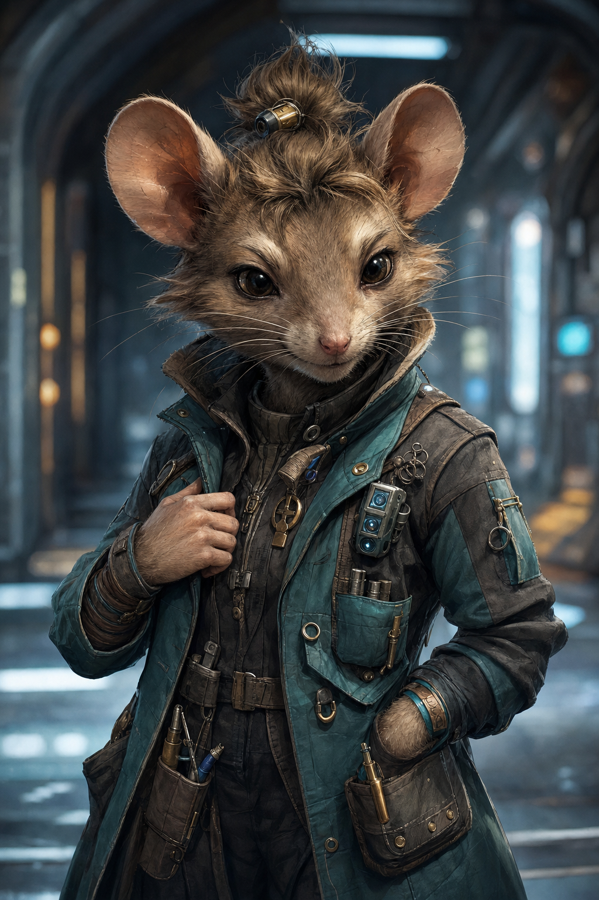

# Whix Chitterclaw

| Classe/Livello | Razza | Tema |
|---|---|---|
| [[Operativo]] 8° | [[Ysoki]] | Fuorilegge (Des +1) |

| Taglia | Velocità | Genere | Mondo Natale |
|---|---|---|---|
| Piccola | 12 m (+3 m Movimento Svelto) | Femmina | Stazione Rottame, avamposto ysoki di riciclaggio navale |

| Allineamento | Divinità | Giocatore |
|---|---|---|
| Caotico Buono | — | *(da assegnare)* |

## Concept

Whix parla in fretta, si muove più in fretta ancora, e ha imparato prestissimo che nessuno si aspetta granché da un'ysoki minuta con l'aria distratta — un vantaggio che sfrutta sistematicamente. Ex borseggiatrice/informatrice riconvertita a investigatrice indipendente, unisce l'amore ysoki per la tecnologia smontata e rimontata a un fiuto quasi innaturale per le bugie altrui. Perfetta per una quest investigativa: è lei che nota il dettaglio fuori posto prima di chiunque altro.

## Punteggi di Caratteristica

| | FOR | DES | COS | INT | SAG | CAR |
|---|---|---|---|---|---|---|
| **Punteggio** | 8 | 19 | 14 | 17 | 12 | 10 |
| **Modificatore** | –1 | +4 | +2 | +3 | +1 | +0 |

Generazione: base 10 → [[Ysoki]] (Des +2, Int +2, For –2) → tema Fuorilegge (Des +1) → 10 punti spesi (Des +5, Int +3, Cos +2) → base 1° livello For 8, Des 18, Cos 12, Int 15, Sag 10, Car 10 → aumento al 5° livello (+1 a Des, essendo ≥17; +2 a Int, Cos, Sag, essendo ≤16) → valori finali sopra.

## Iniziativa

| Totale | = | Mod. Des | + | Varie |
|---|---|---|---|---|
| **+11** | = | +4 | + | +3 ([[Operativo#Vantaggio dell'Operativo 1° Livello\|Vantaggio dell'Operativo]]) + 4 (Iniziativa Migliorata) |

## Salute e Risolutezza

| | Punti Stamina | Punti Ferita | Punti Risolutezza |
|---|---|---|---|
| **Totale** | 64 | 50 | 8 |
| *Calcolo* | (6+2)×8 | 2 [[Ysoki]] + 6×8 [[Operativo]] | 4 (metà liv.) + 4 mod. Des |

## Classe Armatura

| | Totale | = | 10 + | Bonus Armatura | + | Mod. Des | + | Varie |
|---|---|---|---|---|---|---|---|---|
| **CAE** | 22 | = | 10 + | 8 | + | 4 | + | 0 |
| **CAC** | 23 | = | 10 + | 9 | + | 4 | + | 0 |

CA vs. Manovre di Combattimento = 8 + CAC = **31**. RD: nessuna. Resistenze: nessuna.

*Armatura: [[Equipaggiamento/Tuta S II|Tuta S II]] (leggera, Des Massimo +5, nessuna penalità — mantiene attivi [[Operativo#Eludere (Str)|Eludere]] e [[Operativo#Movimento Svelto (Str)|Movimento Svelto]]).*

## Tiri Salvezza

| | Totale | = | Base | + | Mod. Caratteristica | + | Varie |
|---|---|---|---|---|---|---|---|
| **Tempra** (Cos) | +4 | = | +2 | + | +2 | + | 0 |
| **Riflessi** (Des) | +10 | = | +6 | + | +4 | + | 0 |
| **Volontà** (Sag) | +7 | = | +6 | + | +1 | + | 0 |

[[Operativo#Eludere (Str)|Eludere]]: nessun effetto sui TS su Riflessi superati con successo parziale, se non ingombrata e con armatura leggera o nessuna.

## Bonus di Attacco

| | Totale | = | BAB | + | Mod. Caratteristica | + | Varie |
|---|---|---|---|---|---|---|---|
| **Mischia** | +5 | = | +6 | + | –1 (For) | + | 0 |
| **Distanza** | +11 | = | +6 | + | +4 (Des) | + | 1 (Arma Focalizzata) |

## Armi

| Arma | Livello | Bonus Attacco | Danno | Critico | Speciale |
|---|---|---|---|---|---|
| [[Equipaggiamento/Pistola d'Ombra Corvina\|Pistola d'Ombra Corvina]] | 7 | +11 | 1d10+8 freddo *(Arma Specializzata +8)* | Accecare | + [[Operativo#Attacco Ingannevole (Str)\|Attacco Ingannevole]] +4d8 se la prova di inganno ha successo |

## Abilità

Gradi di abilità per livello: 8 + mod. Int = 11 (il più alto del party, a pari merito con Callan Reyes). Abilità di classe ([[Operativo]]): quasi tutte — Acrobazia, Atletica, Camuffare, Computer, Cultura, Furtività, Ingegneria, Intimidire, Intuizione, Medicina, Percezione, Pilotare, Professione, Raggirare, Rapidità di Mano, Sopravvivenza. Tabella completa, tutte le 20 abilità.

| Abilità | Gradi | Bonus Classe | Mod. | Varie | Totale |
|---|---|---|---|---|---|
| [[Acrobazia]] ☑ (Des) | 0 | — | +4 | — | **+4** |
| [[Atletica]] ☑ (For) | 8 | +3 | –1 | — | **+10** |
| [[Camuffare]] ☑ (Car) | 0 | — | +0 | — | **+0** |
| [[Computer]] ☑ (Int) | 8 | +3 | +3 | — | **+14** |
| [[Cultura]] ☑ (Int) | 8 | +3 | +3 | +1 ([[Operativo/Specializzazioni#Detective\|Detective]]) | **+15** |
| [[Diplomazia]] (Car) | 0 | — | +0 | — | **+0** |
| [[Furtività]] ☑ (Des) | 8 | +3 | +4 | +2 ([[Ysoki#Tratti Razziali\|Scroccone]]) | **+17** |
| [[Ingegneria]] ☑ (Int) | 8 | +3 | +3 | +2 (Scroccone) | **+16** |
| [[Intimidire]] ☑ (Car) | 0 | — | +0 | — | **+0** |
| [[Intuizione]] ☑ (Sag) | 8 | +3 | +1 | +1 (Detective) | **+13** |
| [[Medicina]] ☑ (Int) | 0 | — | +3 | — | **+3** |
| [[Misticismo]] (Sag) | 0 | — | +1 | — | **+1** |
| [[Percezione]] ☑ (Sag) | 8 | +3 | +1 | — | **+12** |
| [[Pilotare]] ☑ (Des) | 8 | +3 | +4 | — | **+15** |
| [[Professione]] ☑ (Int — non specializzata) | 0 | — | +3 | — | **+3** |
| [[Raggirare]] ☑ (Car) | 8 | +3 | +0 | — | **+11** |
| [[Rapidità di Mano]] ☑ (Des) | 8 | +3 | +4 | — | **+15** |
| [[Scienza Biologica]] (Int) | 0 | — | +3 | — | **+3** |
| [[Scienza Fisica]] (Int) | 0 | — | +3 | — | **+3** |
| [[Sopravvivenza]] ☑ (Sag) | 8 | +3 | +1 | +2 (Scroccone) | **+14** |

☑ = abilità di classe (bonus +3 se addestrata, richiede ≥1 grado). 11 abilità addestrate (88 gradi, pool esaurito esattamente): Furtività, Percezione, Computer, Cultura, Intuizione, Ingegneria, Raggirare, Rapidità di Mano, Atletica, Pilotare, Sopravvivenza. Con questo pool Whix è competente in quasi ogni abilità del gioco.

## Talenti e Competenze

**Competenze**: armature leggere; armi da mischia base, armi di precisione, armi piccole ([[Operativo]]).

**Talenti** (1°, 3°, 5°, 7°): Iniziativa Migliorata, Arma Focalizzata (Armi Piccole), Schivare, Sinergia dell'Abilità.
**Bonus di classe**: [[Operativo#Arma Specializzata (Str)|Arma Specializzata]] (armi piccole).

## Privilegi di Classe — Operativo

- **Specializzazione: [[Operativo/Specializzazioni#Detective|Detective]]** — Abilità Focalizzata gratuita in Cultura e Intuizione, bonus +4 alle prove di Intuizione per leggere le intenzioni di un nemico ai fini di Attacco Ingannevole
  - Trucco della specializzazione: **[[Operativo/Trucchi#Scorgere la Verità (Str)|Scorgere la Verità]]**
- **[[Operativo#Attacco Ingannevole (Str)|Attacco Ingannevole]]** +4d8
- **[[Operativo#Eludere (Str)|Eludere]]**
- **[[Operativo#Movimento Svelto (Str)|Movimento Svelto]]** +3 m
- **[[Operativo#Vantaggio dell'Operativo 1° Livello|Vantaggio dell'Operativo]]** +3 (Iniziativa, prove di Abilità)
- **Trucchi dell'Operativo** (oltre a [[Operativo/Trucchi#Scorgere la Verità (Str)|Scorgere la Verità]], gratuito dalla specializzazione): [[Operativo/Trucchi#Notare Trappole (Str)|Notare Trappole]] (2°), [[Operativo/Trucchi#Senza Traccia (Str)|Senza Traccia]] (4°), [[Operativo/Trucchi#Hacker Veloce (Str)|Hacker Veloce]] (6°), [[Operativo/Trucchi#Mira Rapida (Str)|Mira Rapida]] (8°)

## Equipaggiamento

| Oggetto | Livello | Ingombro |
|---|---|---|
| [[Equipaggiamento/Tuta S II\|Tuta S II]] | 7 | L |
| [[Equipaggiamento/Pistola d'Ombra Corvina\|Pistola d'Ombra Corvina]] | 7 | L |

**Crediti**: 480 (liquidi — il resto della ricchezza iniziale è già investito nell'equipaggiamento sopra; Whix ha sempre in tasca qualche credito spicciolo e un mucchio di pezzi di ricambio inutili). **Ingombro Totale**: L (leggero).

## Lingue

Comune, più lingue aggiuntive a scelta.

## Tratti Razziali (Ysoki)

Vedi [[Ysoki]] per il testo completo. In sintesi: Umanoide di taglia Piccola, PF razziali 2, Guance Capienti, Scurovisione 18 m, Coraggio (si rialza da Prono come azione rapida, nessuna penalità se Instabile), Scroccone (+2 Ingegneria/Furtività/Sopravvivenza).

## Personalità e interpretazione

Parla velocissimo, salta da un argomento all'altro, e usa l'umorismo come prima linea di difesa quando le cose si fanno tese. Sotto la superficie chiassosa c'è un'osservatrice implacabile: nota tutto, ricorda tutto, e usa quell'informazione con più cura di quanto lasci trasparire. Fedeltà adamantina verso chi considera "suo" — party incluso, nel giro di poche sessioni.

## Note per il GM

- Scheda costruita con le regole di [[Operativo]] e [[Ysoki]] da [[wiki/regole/indice-regolamento|regolamento]] locale, formattata secondo lo standard descritto in `CLAUDE.md`.
- Mondo natale, luogo attuale, crediti e trucchi dell'operativo completati dall'agente per coerenza narrativa, trattandosi di una one-shot. Unico campo lasciato volutamente aperto: `giocatore`, da assegnare quando si forma il tavolo.
- `fazioni` vuoto: Whix opera come freelance indipendente, nessuna affiliazione richiesta dalla quest attuale.
