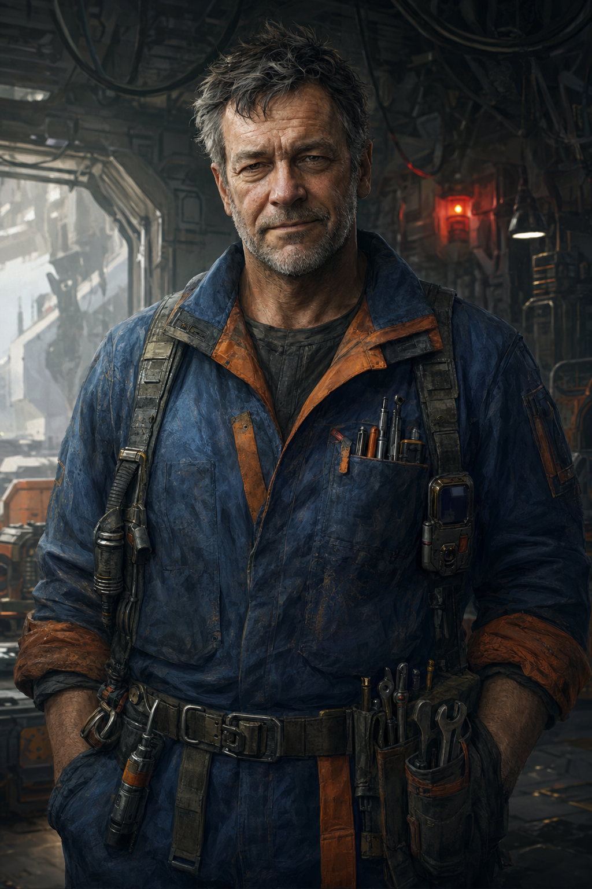

# Tobias "Toby" Ferra

Capo ingegnere della [[stazione-elice-7|Stazione Elice-7]], umano sulla cinquantina. È il primo PNG che i PG incontrano: si è rifugiato nell'hangar d'attracco, l'unica zona che è riuscito a isolare e mettere in sicurezza manualmente, e li contatta via radio locale non appena la loro nave attracca (le interferenze del sistema impediscono comunicazioni a lungo raggio, vedi [[sistema-di-ordessa|Sistema di Ordessa]]).

## Ruolo nella quest

Funge da guida pratica: conosce la pianta della stazione, sa quali aree sono danneggiate o pericolose, e può fornire dettagli tecnici sui guasti (utile per l'evento minore "Il Guasto" nel Braccio B). Non ha risposte sulla natura del fenomeno — quello è il campo di [[renn-kade|Renn Kade]], con cui ha perso i contatti — ma ha visto abbastanza da sapere che i "Tessuti" non sono più le persone che erano.

Può accompagnare il party per un tratto se richiesto, ma preferisce restare all'hangar per tenere pronta una via di fuga: è pragmatico, non eroico, e lo dice apertamente.

## Cosa sa

- Sequenza degli eventi: nell'ultimo mese, sempre più personale ha iniziato a comportarsi in modo "sincronizzato" e distante; dieci giorni fa i sistemi di sicurezza sono impazziti e ha perso i contatti con la maggior parte dell'equipaggio nel giro di poche ore.
- Ha personalmente disattivato e isolato i sistemi di sicurezza automatizzati del Braccio B prima che "si tessessero" anche quelli — parzialmente riuscito, da cui la **Battaglia 1** contro i [[tessuto-corrotto|Tessuti Corrotti]] rimasti attivi.
- Ha visto una squadra armata non-Solmark ([[ilsa-draak|Ilsa Draak]] e i suoi) attraccare senza autorizzazione circa una settimana fa e dirigersi verso il Braccio C.
- Non sa nulla del Telaio stesso: il suo accesso era limitato alle sezioni tecniche, mai al sito archeologico.

## Personalità

Diretto, brusco ma non ostile, con un umorismo secco da persona che ha visto troppe emergenze tecniche per spaventarsi facilmente — finché non si spaventa davvero. Rispetta la competenza più delle credenziali: un PG che risolve un problema tecnico davanti a lui guadagna la sua fiducia più in fretta di uno che si limita a mostrare l'autorizzazione di [[imara-voss|Imara Voss]].

### Spunti rapidi per l'interprete

- **Tic**: valuta chiunque incontri dal modo in cui maneggia strumenti o problemi tecnici, prima ancora di ascoltarlo parlare.
- **Se messo alle strette**: l'umorismo secco sparisce di colpo — quando è davvero spaventato, si vede.
- **Con chi**: rispetta più un PG che risolve un problema tecnico sul posto che uno che si limita a mostrare l'autorizzazione di Imara Voss.
